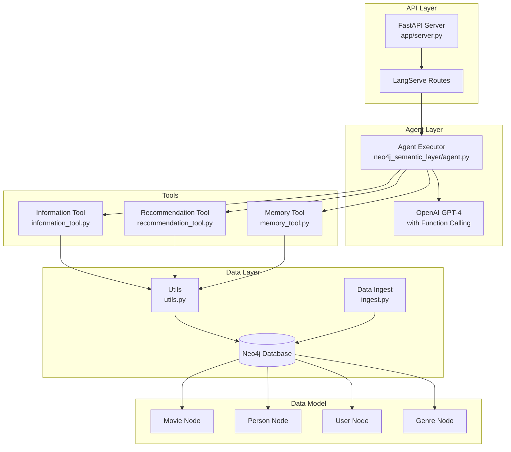
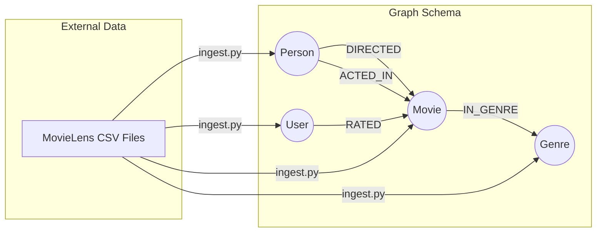

# LLM Movie Agent API Architecture Overview

## Project Overview

The `llm-movieagent` API is a sophisticated semantic layer implementation on top of a Neo4j graph database that enables natural language interactions for movie recommendations and information retrieval. Built using LangChain, LangServe, and OpenAI's function calling capabilities, it provides an intelligent agent that can understand user queries about movies, actors, and provide personalized recommendations.

## High-Level Architecture



## Core Components

### 1. API Layer (`app/server.py`)

The API layer uses FastAPI and LangServe to expose the agent as a web service:

```python
app = FastAPI()
add_routes(app, neo4j_semantic_agent, path="/movie-agent")
```

- **FastAPI**: Provides the web framework for handling HTTP requests
- **LangServe**: Integrates LangChain agents with FastAPI, automatically creating REST endpoints
- **Endpoints**: 
  - `/` - Redirects to documentation
  - `/movie-agent` - Main agent endpoint for processing queries
  - `/docs` - Auto-generated API documentation

### 2. Agent Configuration (`neo4j_semantic_layer/agent.py`)

The agent is configured with:

- **LLM**: OpenAI GPT-4 with function calling enabled
- **Temperature**: Set to 0 for deterministic responses
- **Streaming**: Enabled for real-time response streaming
- **Prompt Template**: System prompt that defines the agent's behavior and capabilities

```python
llm = ChatOpenAI(temperature=0, model="gpt-4", streaming=True)
tools = [InformationTool(), RecommenderTool(), MemoryTool()]
```

The agent uses a sophisticated prompt that instructs it to:
- Find information about movies and make recommendations
- Ask follow-up questions when clarification is needed
- Only perform specifically requested actions
- Include available options in follow-up questions

### 3. Tools System

The agent has access to three specialized tools:

#### Information Tool (`information_tool.py`)
- **Purpose**: Retrieves detailed information about movies or persons
- **Functionality**:
  - Uses full-text search to find entities
  - Handles ambiguous queries by asking for clarification
  - Returns structured information including:
    - Movie details (title, year, rating)
    - Person details (name, roles)
    - Relationships (acted in, directed, genres)

#### Recommendation Tool (`recommendation_tool.py`)
- **Purpose**: Provides movie recommendations based on various criteria
- **Strategies**:
  1. **History-based**: Recommends based on user's highly-rated movies (>3.5 rating)
  2. **Genre-based**: Top-rated unwatched movies in specified genre
  3. **Movie-based**: Similar movies based on collaborative filtering
- **Features**:
  - Filters out already-watched movies
  - Supports 19 different genre categories
  - Combines multiple recommendation strategies

#### Memory Tool (`memory_tool.py`)
- **Purpose**: Stores user preferences and movie ratings
- **Functionality**:
  - Creates/updates user nodes in the graph
  - Stores movie ratings (1-5 scale)
  - Enables personalized recommendations over time
  - Uses a placeholder user ID (currently hardcoded as 1)

### 4. Data Layer

#### Neo4j Graph Database Schema



**Node Types:**
- **Movie**: id, title, released (date), imdbRating
- **Person**: name (actors and directors)
- **User**: userId
- **Genre**: name

**Relationship Types:**
- **DIRECTED**: Person → Movie
- **ACTED_IN**: Person → Movie
- **IN_GENRE**: Movie → Genre
- **RATED**: User → Movie (includes rating and timestamp)

**Indices:**
- Unique constraints on Movie.id, User.id, Person.name, Genre.name
- Full-text indices on Movie.title and Person.name for fuzzy searching

#### Data Ingestion (`ingest.py`)

The ingestion process:
1. Creates database constraints and indices
2. Loads movie data from CSV files hosted on GitHub
3. Processes relationships (directors, actors, genres)
4. Loads user ratings data
5. Creates full-text search indices

Data source: https://raw.githubusercontent.com/tomasonjo/blog-datasets/main/movies/

### 5. Utility Functions (`utils.py`)

Key utilities include:

- **`get_user_id()`**: Returns current user ID (placeholder implementation)
- **`remove_lucene_chars()`**: Sanitizes input for Lucene queries
- **`generate_full_text_query()`**: Creates fuzzy search queries with ~0.8 similarity threshold
- **`get_candidates()`**: Performs full-text search and returns matching entities

### 6. Environment Configuration

Required environment variables:
```
OPENAI_API_KEY=<YOUR_OPENAI_API_KEY>
NEO4J_URI=<YOUR_NEO4J_URI>
NEO4J_USERNAME=<YOUR_NEO4J_USERNAME>
NEO4J_PASSWORD=<YOUR_NEO4J_PASSWORD>
```

Optional for tracing:
```
LANGCHAIN_TRACING_V2=true
LANGCHAIN_API_KEY=<your-api-key>
LANGCHAIN_PROJECT=<your-project>
```

## Workflow Example

1. **User Query**: "What do you know about John Travolta?"
2. **Agent Processing**:
   - Receives query through FastAPI endpoint
   - Uses Information Tool
   - Tool performs full-text search for "John"
   - If multiple Johns found, asks for clarification
   - If user specifies "John Travolta", retrieves full information
3. **Response**: Returns structured information about John Travolta including movies acted in

## Deployment

### Docker Configuration

The project includes a Dockerfile for containerization:
- Base image: `python:3.11-slim`
- Uses Poetry for dependency management
- Exposes port 8080
- Runs with Uvicorn ASGI server

### Local Development

```bash
# Install dependencies
pip install -U "langchain-cli[serve]"

# Create new project with this package
langchain app new my-app --package neo4j-semantic-layer

# Or add to existing project
langchain app add neo4j-semantic-layer

# Run locally
langchain serve
```

## Key Design Decisions

1. **Function Calling**: Leverages OpenAI's function calling for structured tool selection
2. **Semantic Layer**: Abstracts complex Cypher queries behind intuitive tool interfaces
3. **Full-text Search**: Uses Neo4j's full-text indices with fuzzy matching for user-friendly queries
4. **Stateful Conversations**: Maintains chat history for context-aware responses
5. **Modular Architecture**: Clear separation between API, agent logic, tools, and data layers

## Testing

The package includes a `main.py` file demonstrating basic usage:
```python
original_query = "What do you know about person John?"
followup_query = "John Travolta"
```

This shows the agent's ability to handle ambiguous queries and maintain conversation context.

## Security Considerations

- All sensitive credentials managed via environment variables
- Neo4j connection uses authenticated access
- No hardcoded secrets in codebase
- Docker image doesn't include credentials

## Limitations and Future Improvements

1. **User Management**: Currently uses hardcoded user ID (1)
2. **Scalability**: Single Neo4j instance may need clustering for high load
3. **Caching**: No caching layer for frequently accessed data
4. **Authentication**: No user authentication/authorization implemented
5. **Rate Limiting**: No API rate limiting in place

## Conclusion

The llm-movieagent API demonstrates a sophisticated implementation of a semantic layer over a graph database, enabling natural language interactions for movie discovery and recommendations. Its modular architecture, combined with LangChain's agent framework and Neo4j's graph capabilities, creates a powerful and extensible system for conversational movie exploration. 