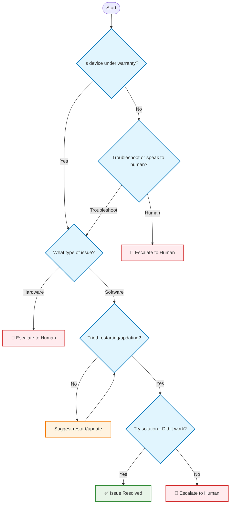

# Building a Tech Support Bot with LangGraph: A Complete Workflow Tutorial

This tutorial demonstrates how to build a sophisticated tech support bot using LangGraph that handles warranty checks, issue classification, troubleshooting loops, and escalation to human agents.

## Workflow Diagram



## Overview

Our bot implements a 4-step workflow that showcases key LangGraph concepts:
- **Conditional routing** based on warranty status and issue type
- **Looping** for troubleshooting attempts
- **Human escalation** for complex issues
- **State management** to track conversation progress

## Workflow Steps

### Step 1: Warranty Check
- **YES** → Proceed to Step 2 (Issue Classification)
- **NO** → Ask: "Would you like to troubleshoot or speak to a human about repair options?"
  - **Human** → 🧑 Escalate
  - **Troubleshoot** → Step 2

### Step 2: Issue Classification
- **Hardware-related** → 🧑 Escalate (hardware requires human expertise)
- **Software-related or unclear** → Proceed to Step 3

### Step 3: Basic Troubleshooting Check
- **NO** (haven't tried restarting/updating) → Suggest trying that → 🔁 Loop back to Step 3
- **YES** → Proceed to Step 4

### Step 4: Solution Testing
- **YES** (solution worked) → ✅ Success message
- **NO** → 🧑 Escalate to human support

## Implementation

```python
import os
from dataclasses import dataclass
from typing import List, Optional, Literal, Annotated, Dict

from langchain.chat_models import init_chat_model
from langchain_core.messages import AIMessage, ToolMessage, BaseMessage, HumanMessage
from langchain_core.tools import tool, InjectedToolCallId

from langgraph.graph import StateGraph
from langgraph.prebuilt import ToolNode
from langgraph.types import Command

llm = init_chat_model("anthropic:claude-3-5-sonnet-latest")


@dataclass
class State:
  messages: List[BaseMessage]
  is_last_step: bool = False
  workflow_step: str = "start"

  # State tracking for our 4-step workflow
  warranty_status: Optional[str] = None  # "in" or "out"
  wants_human_help: Optional[bool] = None  # for out-of-warranty users
  issue_type: Optional[str] = None  # "hardware" or "software"
  tried_basic_steps: Optional[bool] = None
  solution_successful: Optional[bool] = None

@tool
def set_warranty_status(
        value: Literal["in", "out"],
        tool_call_id: Annotated[str, InjectedToolCallId]
) -> Command:
  """Set whether device is under warranty"""
  return Command(update={
    "warranty_status": value,
    "messages": [ToolMessage(content=f"Warranty status set to '{value}'",
                             tool_call_id=tool_call_id)]
  })


@tool
def set_wants_human_help(
        value: Literal["true", "false"],
        tool_call_id: Annotated[str, InjectedToolCallId]
) -> Command:
  """Set whether user wants human help for out-of-warranty device"""
  parsed = value.lower() == "true"
  return Command(update={
    "wants_human_help": parsed,
    "messages": [
      ToolMessage(content=f"Wants human help: {parsed}", tool_call_id=tool_call_id)]
  })


@tool
def set_issue_type(
        value: Literal["hardware", "software"],
        tool_call_id: Annotated[str, InjectedToolCallId]
) -> Command:
  """Classify the issue as hardware or software related"""
  return Command(update={
    "issue_type": value,
    "messages": [
      ToolMessage(content=f"Issue type set to '{value}'", tool_call_id=tool_call_id)]
  })


@tool
def set_tried_basic_steps(
        value: Literal["true", "false"],
        tool_call_id: Annotated[str, InjectedToolCallId]
) -> Command:
  """Record whether user has tried basic troubleshooting"""
  parsed = value.lower() == "true"
  return Command(update={
    "tried_basic_steps": parsed,
    "messages": [
      ToolMessage(content=f"Tried basic steps: {parsed}", tool_call_id=tool_call_id)]
  })


@tool
def set_solution_successful(
        value: Literal["true", "false"],
        tool_call_id: Annotated[str, InjectedToolCallId]
) -> Command:
  """Record whether the suggested solution worked"""
  parsed = value.lower() == "true"
  return Command(update={
    "solution_successful": parsed,
    "messages": [
      ToolMessage(content=f"Solution successful: {parsed}", tool_call_id=tool_call_id)]
  })


ALL_TOOLS = [
  set_warranty_status,
  set_wants_human_help,
  set_issue_type,
  set_tried_basic_steps,
  set_solution_successful,
]

# -------------------------------
# Tool Mapping by Workflow Step
# -------------------------------

TOOL_MAP = {
  "check_warranty": [set_warranty_status],
  "ask_repair_or_continue": [set_wants_human_help],
  "ask_issue_type": [set_issue_type],
  "check_troubleshooting": [set_tried_basic_steps],
  "suggest_troubleshooting": [set_tried_basic_steps],
  "offer_solution": [set_solution_successful],
}


# -------------------------------
# Step-Specific Prompts
# -------------------------------

def get_prompt_for_step(step: str) -> str:
  """Get the appropriate prompt for each workflow step"""
  prompts = {
    "check_warranty": """
        Ask the user whether their device is under warranty. 
        Use the set_warranty_status tool to record their response as 'in' or 'out'.
        """,

    "ask_repair_or_continue": """
        The device is out of warranty. Ask if they'd like to:
        1. Continue troubleshooting themselves, or 
        2. Speak to a human about repair options
        Use the set_wants_human_help tool to record their choice.
        """,

    "ask_issue_type": """
        Ask what issue they are experiencing with their device. 
        Based on their response, classify it as 'hardware' (physical problems, broken parts) 
        or 'software' (app crashes, performance issues, etc.).
        Use the set_issue_type tool to record the classification.
        """,

    "check_troubleshooting": """
        Ask if they have already tried basic troubleshooting steps like:
        - Restarting the device
        - Updating the software/app
        Use the set_tried_basic_steps tool to record their response.
        """,

    "suggest_troubleshooting": """
        Suggest they try restarting their device and updating the software/app.
        Ask them to try these steps and confirm once they're done.
        Use the set_tried_basic_steps tool once they confirm they've tried.
        """,

    "offer_solution": """
        Suggest they reset the app settings or clear the app cache.
        Ask them to try this solution and confirm if it resolved the issue.
        Use the set_solution_successful tool to record whether it worked.
        """,
  }
  return prompts.get(step, "Continue helping the user with their issue.")


# -------------------------------
# Model Node
# -------------------------------

async def call_model(state: State) -> Dict[str, List[AIMessage]]:
  """Call the LLM with appropriate tools for the current step"""
  prompt = get_prompt_for_step(state.workflow_step)
  tools = TOOL_MAP.get(state.workflow_step, [])
  model = llm.bind_tools(tools)

  response = await model.ainvoke(
    [{"role": "system", "content": prompt}, *state.messages]
  )

  return {"messages": [response]}


# -------------------------------
# Routing Logic - The Heart of Our Workflow
# -------------------------------

def route_workflow(state: State) -> Literal[
  "check_warranty",
  "ask_repair_or_continue",
  "ask_issue_type",
  "check_troubleshooting",
  "suggest_troubleshooting",
  "offer_solution",
  "success",
  "escalate"
]:
  """Route to the next step based on current state and user responses"""
  step = state.workflow_step

  # Step 1: Start with warranty check
  if step == "start":
    return "check_warranty"

  # Step 1 → Step 2 or repair question
  if step == "check_warranty":
    if state.warranty_status == "out":
      return "ask_repair_or_continue"
    elif state.warranty_status == "in":
      return "ask_issue_type"

  # Out of warranty: continue troubleshooting or escalate
  if step == "ask_repair_or_continue":
    if state.wants_human_help:
      return "escalate"
    else:
      return "ask_issue_type"

  # Step 2: Hardware → escalate, Software → continue
  if step == "ask_issue_type":
    if state.issue_type == "hardware":
      return "escalate"
    elif state.issue_type == "software":
      return "check_troubleshooting"

  # Step 3: Check if they've tried basic steps
  if step == "check_troubleshooting":
    if state.tried_basic_steps is False:
      return "suggest_troubleshooting"
    elif state.tried_basic_steps is True:
      return "offer_solution"

  # Step 3 loop: After suggesting troubleshooting, check again
  if step == "suggest_troubleshooting":
    return "check_troubleshooting"

  # Step 4: Solution worked → success, didn't work → escalate
  if step == "offer_solution":
    if state.solution_successful is True:
      return "success"
    elif state.solution_successful is False:
      return "escalate"

  # Default fallback
  return "escalate"


def route_model_output(state: State) -> Literal["tools", "route_workflow"]:
  """Determine if we need to use tools or continue routing"""
  last_msg = state.messages[-1]
  if isinstance(last_msg, AIMessage) and last_msg.tool_calls:
    return "tools"
  return "route_workflow"


# -------------------------------
# Workflow Step Updater
# -------------------------------

def update_workflow_step(state: State, next_step: str) -> Dict:
  """Update the workflow step when transitioning"""
  return {"workflow_step": next_step}


# -------------------------------
# Terminal Nodes
# -------------------------------

def success_node(state: State) -> Dict:
  """Handle successful resolution"""
  return {
    "messages": [AIMessage(
      content="Great! I'm glad we could resolve your issue. Is there anything else I can help you with today?")],
    "is_last_step": True
  }


def escalate_node(state: State) -> Dict:
  """Handle escalation to human support"""
  return {
    "messages": [AIMessage(
      content="I'm going to connect you with one of our human support specialists who can better assist you with this issue. Please hold on while I transfer you.")],
    "is_last_step": True
  }


# -------------------------------
# Build the Graph
# -------------------------------

builder = StateGraph(State)

# Set entry point
builder.set_entry_point("route_workflow")

# Add all nodes
builder.add_node("call_model", call_model)
builder.add_node("tools", ToolNode(ALL_TOOLS))
builder.add_node("route_workflow", route_workflow)
builder.add_node("success", success_node)
builder.add_node("escalate", escalate_node)

# Workflow step nodes that update the step and call the model
for step in ["check_warranty", "ask_repair_or_continue", "ask_issue_type",
             "check_troubleshooting", "suggest_troubleshooting", "offer_solution"]:
  builder.add_node(step, lambda state, s=step: {**update_workflow_step(state, s),
                                                **call_model(state)})

# Main routing logic
builder.add_conditional_edges(
  "route_workflow",
  route_workflow,
  ["check_warranty", "ask_repair_or_continue", "ask_issue_type",
   "check_troubleshooting", "suggest_troubleshooting", "offer_solution",
   "success", "escalate"]
)

# Model output routing
builder.add_conditional_edges(
  "call_model",
  route_model_output,
  ["tools", "route_workflow"]
)

# Tool execution flows back to model
builder.add_edge("tools", "call_model")

# Step nodes flow back to routing
for step in ["check_warranty", "ask_repair_or_continue", "ask_issue_type",
             "check_troubleshooting", "suggest_troubleshooting", "offer_solution"]:
  builder.add_conditional_edges(
    step,
    route_model_output,
    ["tools", "route_workflow"]
  )

# Compile the graph
graph = builder.compile()

# -------------------------------
# Example Usage
# -------------------------------

if __name__ == "__main__":
  import asyncio


  async def run_example():
    """Run an example conversation"""
    print("\n🔁 Running Tech Support Workflow...\n")

    initial_state = State(
      messages=[
        HumanMessage(content="Hi, my app is crashing a lot and I can't use it.")],
      workflow_step="start"
    )

    final_state = await graph.ainvoke(initial_state)

    print("\n✅ Conversation Complete!")
    print(f"Final workflow step: {final_state.workflow_step}")
    print(f"Warranty status: {final_state.warranty_status}")
    print(f"Issue type: {final_state.issue_type}")
    print(f"Tried basic steps: {final_state.tried_basic_steps}")
    print(f"Solution successful: {final_state.solution_successful}")

    print("\n💬 Final messages:")
    for msg in final_state.messages[-3:]:  # Show last 3 messages
      if isinstance(msg, HumanMessage):
        print(f"User: {msg.content}")
      elif isinstance(msg, AIMessage):
        print(f"Bot: {msg.content}")


  asyncio.run(run_example())
```

## Key Features Demonstrated

### 1. **Conditional Routing**
The `route_workflow` function implements complex decision logic:
- Warranty status determines initial path
- Issue type (hardware vs software) triggers different responses
- Solution success determines final outcome

### 2. **Looping Behavior**
Step 3 creates a loop where users who haven't tried basic troubleshooting are guided through it:
```
check_troubleshooting → suggest_troubleshooting → check_troubleshooting
```

### 3. **Human Escalation**
Multiple escalation points ensure complex issues reach human agents:
- Out-of-warranty users can choose human help
- Hardware issues automatically escalate
- Failed solutions trigger escalation

### 4. **State Management**
The workflow tracks user progress through structured state variables, enabling complex multi-turn conversations.

## Testing the Workflow

Try different conversation paths:

1. **In-warranty software issue** → Full troubleshooting flow
2. **Out-of-warranty hardware issue** → Immediate escalation
3. **Software issue with successful solution** → Success completion
4. **Software issue with failed solution** → Escalation

This implementation showcases how LangGraph can handle real-world customer service scenarios with sophisticated routing, looping, and escalation logic.