# Build a tech support bot with custom workflows

In this tutorial, you'll build a sophisticated tech support bot using LangGraph that demonstrates how to create custom workflows with conditional routing, loops, and human escalation. This bot will guide users through a structured support process, automatically routing them based on their responses and issue type.

## What you'll learn

By the end of this tutorial, you'll understand how to:

- Create **conditional routing** that adapts based on user responses
- Implement **loops** for iterative troubleshooting
- Handle **human escalation** at multiple decision points
- Use **state management** to track complex multi-step conversations
- Build a complete customer service workflow

## Prerequisites

Before you start this tutorial, ensure you have access to a LLM that supports tool-calling features, such as [OpenAI](https://platform.openai.com/api-keys), [Anthropic](https://console.anthropic.com/settings/keys), or [Google Gemini](https://ai.google.dev/gemini-api/docs/api-key).

## The workflow

Our tech support bot follows a 4-step decision tree:

1. **Warranty Check** - Is the device under warranty?
2. **Issue Classification** - Hardware or software issue?
3. **Basic Troubleshooting** - Have they tried restarting/updating?
4. **Solution Testing** - Did the suggested solution work?

```mermaid
flowchart TD
    Start([Start]) --> Step1{Is device under warranty?}
    
    Step1 -->|Yes| Step2{What type of issue?}
    Step1 -->|No| RepairChoice{Troubleshoot or speak to human?}
    
    RepairChoice -->|Human| Escalate1[🧑 Escalate to Human]
    RepairChoice -->|Troubleshoot| Step2
    
    Step2 -->|Hardware| Escalate2[🧑 Escalate to Human]
    Step2 -->|Software| Step3{Tried restarting/updating?}
    
    Step3 -->|No| Suggest[Suggest restart/update]
    Step3 -->|Yes| Step4{Try solution - Did it work?}
    
    Suggest --> Step3
    
    Step4 -->|Yes| Success[✅ Issue Resolved]
    Step4 -->|No| Escalate3[🧑 Escalate to Human]
    
    classDef stepNode fill:#e1f5fe,stroke:#0277bd,stroke-width:2px
    classDef escalateNode fill:#ffebee,stroke:#d32f2f,stroke-width:2px
    classDef successNode fill:#e8f5e8,stroke:#388e3c,stroke-width:2px
    classDef loopNode fill:#fff3e0,stroke:#f57c00,stroke-width:2px
    
    class Step1,Step2,Step3,Step4,RepairChoice stepNode
    class Escalate1,Escalate2,Escalate3 escalateNode
    class Success successNode
    class Suggest loopNode
```



## 1. Install packages

Install the required packages:

```bash
pip install -U langgraph langsmith langchain-anthropic
```

!!! tip

    Sign up for LangSmith to quickly spot issues and improve the performance of your LangGraph projects. LangSmith lets you use trace data to debug, test, and monitor your LLM apps built with LangGraph. For more information on how to get started, see [LangSmith docs](https://docs.smith.langchain.com).

## 2. Define the state

First, define the state structure that will track the conversation and workflow progress:

```python
import os
from dataclasses import dataclass
from typing import List, Optional, Literal, Annotated, Dict

from langchain.chat_models import init_chat_model
from langchain_core.messages import AIMessage, ToolMessage, BaseMessage, HumanMessage
from langchain_core.tools import tool, InjectedToolCallId

from langgraph.graph import StateGraph
from langgraph.prebuilt import ToolNode
from langgraph.types import Command

@dataclass
class State:
    messages: List[BaseMessage]
    is_last_step: bool = False
    workflow_step: str = "start"

    # State tracking for our 4-step workflow
    warranty_status: Optional[Literal["in", "out"]] = None
    wants_human_help: Optional[bool] = None  # for out-of-warranty users
    issue_type: Optional[Literal["hardware", "software"]] = None
    tried_basic_steps: Optional[bool] = None
    solution_successful: Optional[bool] = None
```

!!! tip "Concept"

    The `State` class tracks both the conversation messages and the workflow progress. Each field represents a decision point in our support process, allowing the bot to remember where the user is in the troubleshooting flow.

## 3. Create tools for state management

Create tools that the LLM can use to update the workflow state based on user responses:

```python

@tool
def set_warranty_status(
        value: Literal["in", "out"],
        tool_call_id: Annotated[str, InjectedToolCallId]
) -> Command:
    """Set whether device is under warranty"""
    # Determine next step based on warranty status
    if value == "out":
        next_step = "ask_repair_or_continue"
    else:
        next_step = "ask_issue_type"
    
    return Command(update={
        "warranty_status": value,
        "workflow_step": next_step,
        "messages": [ToolMessage(content=f"Warranty status set to '{value}'",
                                 tool_call_id=tool_call_id)]
    })

@tool
def set_wants_human_help(
        value: Literal[True, False],
        tool_call_id: Annotated[str, InjectedToolCallId]
) -> Command:
    """Set whether user wants human help for out-of-warranty device"""
    # If they want human help, escalate; otherwise continue to issue classification
    if value:
        next_step = "escalate"
    else:
        next_step = "ask_issue_type"
    
    return Command(update={
        "wants_human_help": value,
        "workflow_step": next_step,
        "messages": [
            ToolMessage(content=f"Wants human help: {value}", tool_call_id=tool_call_id)]
    })

@tool
def set_issue_type(
        value: Literal["hardware", "software"],
        tool_call_id: Annotated[str, InjectedToolCallId]
) -> Command:
    """Classify the issue as hardware or software related"""
    # Hardware issues escalate immediately; software issues go to troubleshooting
    if value == "hardware":
        next_step = "escalate"
    else:
        next_step = "check_troubleshooting"
    
    return Command(update={
        "issue_type": value,
        "workflow_step": next_step,
        "messages": [
            ToolMessage(content=f"Issue type set to '{value}'", tool_call_id=tool_call_id)]
    })

@tool
def set_tried_basic_steps(
        value: Literal[True, False],
        tool_call_id: Annotated[str, InjectedToolCallId]
) -> Command:
    """Record whether user has tried basic troubleshooting"""
    # If they haven't tried basic steps, suggest them; otherwise offer solution
    if not value:
        next_step = "suggest_troubleshooting"
    else:
        next_step = "offer_solution"
    
    return Command(update={
        "tried_basic_steps": value,
        "workflow_step": next_step,
        "messages": [
            ToolMessage(content=f"Tried basic steps: {value}", tool_call_id=tool_call_id)]
    })

@tool
def confirm_troubleshooting_done(
        tool_call_id: Annotated[str, InjectedToolCallId]
) -> Command:
    """Confirm user has completed suggested troubleshooting steps"""
    return Command(update={
        "tried_basic_steps": True,
        "workflow_step": "check_troubleshooting",
        "messages": [
            ToolMessage(content="Troubleshooting steps completed", tool_call_id=tool_call_id)]
    })

@tool
def set_solution_successful(
        value: Literal[True, False],
        tool_call_id: Annotated[str, InjectedToolCallId]
) -> Command:
    """Record whether the suggested solution worked"""
    # If solution worked, success; otherwise escalate
    if value:
        next_step = "success"
    else:
        next_step = "escalate"
    
    return Command(update={
        "solution_successful": value,
        "workflow_step": next_step,
        "messages": [
            ToolMessage(content=f"Solution successful: {value}", tool_call_id=tool_call_id)]
    })

ALL_TOOLS = [
    set_warranty_status,
    set_wants_human_help,
    set_issue_type,
    set_tried_basic_steps,
    confirm_troubleshooting_done,
    set_solution_successful,
]
```

These tools now handle both state updates and workflow transitions. Each tool determines the next step in the workflow based on the user's response, eliminating the need for complex routing logic.

## 4. Set up the chat model



<!---
```python
llm = init_chat_model("anthropic:claude-3-5-sonnet-latest")
```
-->

## 5. Create step-specific prompts

Each workflow step needs a specific prompt to guide the LLM's behavior:

```python

TOOL_MAP = {
    "check_warranty": [set_warranty_status],
    "ask_repair_or_continue": [set_wants_human_help],
    "ask_issue_type": [set_issue_type],
    "check_troubleshooting": [set_tried_basic_steps],
    "suggest_troubleshooting": [confirm_troubleshooting_done],
    "offer_solution": [set_solution_successful],
}

def get_prompt_for_step(step: str) -> str:
    """Get the appropriate prompt for each workflow step"""
    prompts = {
        "check_warranty": """
            Ask the user whether their device is under warranty. 
            Use the set_warranty_status tool to record their response as 'in' or 'out'.
            """,

        "ask_repair_or_continue": """
            The device is out of warranty. Ask if they'd like to:
            1. Continue troubleshooting themselves, or 
            2. Speak to a human about repair options
            Use the set_wants_human_help tool to record their choice.
            """,

        "ask_issue_type": """
            Ask what issue they are experiencing with their device. 
            Based on their response, classify it as 'hardware' (physical problems, broken parts) 
            or 'software' (app crashes, performance issues, etc.).
            Use the set_issue_type tool to record the classification.
            """,

        "check_troubleshooting": """
            Ask if they have already tried basic troubleshooting steps like:
            - Restarting the device
            - Updating the software/app
            Use the set_tried_basic_steps tool to record their response.
            """,

        "suggest_troubleshooting": """
            Suggest they try restarting their device and updating the software/app.
            Ask them to try these steps and confirm once they're done.
            Use the confirm_troubleshooting_done tool once they confirm they've tried.
            """,

        "offer_solution": """
            Suggest they reset the app settings or clear the app cache.
            Ask them to try this solution and confirm if it resolved the issue.
            Use the set_solution_successful tool to record whether it worked.
            """,
    }
    return prompts.get(step, "Continue helping the user with their issue.")
```

## 6. Create the model node

The model node handles LLM interactions with the appropriate tools for each step:

```python


async def call_model(state: State) -> Dict:
    """Call the LLM with appropriate tools for the current step"""
    # Handle terminal states
    if state.workflow_step == "success":
        return {
            "messages": [AIMessage(
                content="Great! I'm glad we could resolve your issue. Is there anything else I can help you with today?")],
            "is_last_step": True
        }
    elif state.workflow_step == "escalate":
        return {
            "messages": [AIMessage(
                content="I'm going to connect you with one of our human support specialists who can better assist you with this issue. Please hold on while I transfer you.")],
            "is_last_step": True
        }
    
    # For regular workflow steps, get the appropriate prompt and tools
    prompt = get_prompt_for_step(state.workflow_step)
    tools = TOOL_MAP.get(state.workflow_step, [])
    model = llm.bind_tools(tools)

    response = await model.ainvoke(
        [{"role": "system", "content": prompt}, *state.messages]
    )

    return {"messages": [response]}

def should_continue(state: State) -> Literal["tools", "call_model", "__end__"]:
    """Determine whether to call tools or continue with the model"""
    # If we've reached a terminal state, stop
    if state.is_last_step:
        return "__end__"
    
    # If the last message has tool calls, execute them
    last_msg = state.messages[-1]
    if isinstance(last_msg, AIMessage) and last_msg.tool_calls:
        return "tools"
    
    # Otherwise, continue with the model
    return "call_model"
```

!!! tip "Concept"

    This simplified approach moves all the routing logic into the tools themselves. Each tool determines the next workflow step, eliminating the need for complex conditional routing functions. The `should_continue` function simply decides whether to execute tools or continue with the model.

## 8. Build and compile the graph

Now assemble all the components into a complete workflow:

```python
from langgraph.graph import StateGraph, START, END

builder = StateGraph(State)

# Add nodes
builder.add_node("call_model", call_model)
builder.add_node("tools", ToolNode(ALL_TOOLS))

# Set entry point
builder.add_edge(START, "call_model")

# Add conditional edges
builder.add_conditional_edges(
    "call_model",
    should_continue,
    ["tools", "call_model", END]
)

# Tools flow back to model
builder.add_edge("tools", "call_model")

# Compile the graph
graph = builder.compile()
```

## 9. Test the workflow

Run the tech support bot to see how it handles different scenarios:

```python
import asyncio

async def run_example():
    """Run an example conversation"""
    print("\n🔁 Running Tech Support Workflow...\n")

    initial_state = State(
        messages=[
            HumanMessage(content="Hi, my app is crashing a lot and I can't use it.")],
        workflow_step="check_warranty"
    )

    final_state = await graph.ainvoke(initial_state)

    print("\n✅ Conversation Complete!")
    print(f"Final workflow step: {final_state.workflow_step}")
    print(f"Warranty status: {final_state.warranty_status}")
    print(f"Issue type: {final_state.issue_type}")
    print(f"Tried basic steps: {final_state.tried_basic_steps}")
    print(f"Solution successful: {final_state.solution_successful}")

    print("\n💬 Final messages:")
    for msg in final_state.messages[-3:]:  # Show last 3 messages
        if isinstance(msg, HumanMessage):
            print(f"User: {msg.content}")
        elif isinstance(msg, AIMessage):
            print(f"Bot: {msg.content}")

if __name__ == "__main__":
    asyncio.run(run_example())
```

!!! tip

    You can exit the conversation at any time by typing `quit`, `exit`, or `q`.

## Key concepts demonstrated

This tech support bot showcases several important LangGraph concepts:

### 1. **Conditional routing**
The `route_workflow` function implements complex decision logic based on user responses:
- Warranty status determines the initial path
- Issue type (hardware vs software) triggers different responses  
- Solution success determines the final outcome

### 2. **Looping behavior**
Step 3 creates a loop where users who haven't tried basic troubleshooting are guided through it:
```
check_troubleshooting → suggest_troubleshooting → check_troubleshooting
```

### 3. **Human escalation**
Multiple escalation points ensure complex issues reach human agents:
- Out-of-warranty users can choose human help
- Hardware issues automatically escalate
- Failed solutions trigger escalation

### 4. **State management**
The workflow tracks user progress through structured state variables, enabling complex multi-turn conversations.

## Testing different scenarios

Try these conversation paths to see how the bot handles various situations:

1. **In-warranty software issue** → Full troubleshooting flow
2. **Out-of-warranty hardware issue** → Immediate escalation
3. **Software issue with successful solution** → Success completion
4. **Software issue with failed solution** → Escalation

## Next steps

This implementation demonstrates how LangGraph can handle real-world customer service scenarios with sophisticated routing, looping, and escalation logic. You can extend this pattern to build more complex workflows for various business processes.
