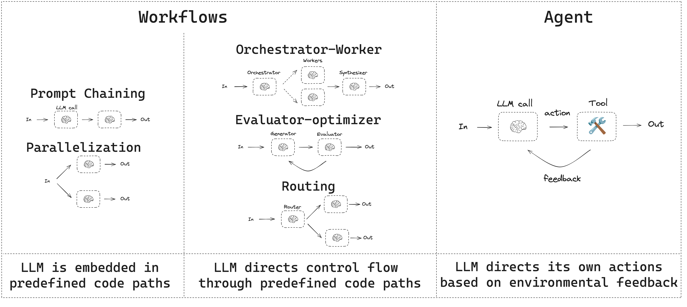
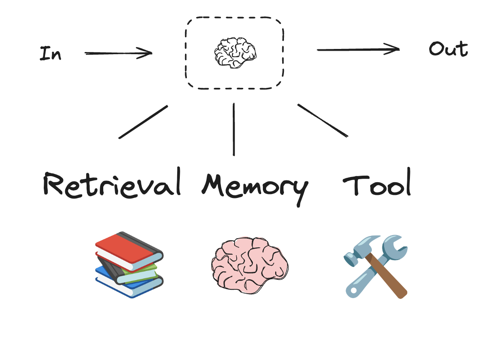
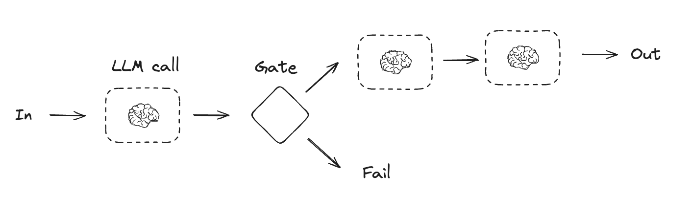
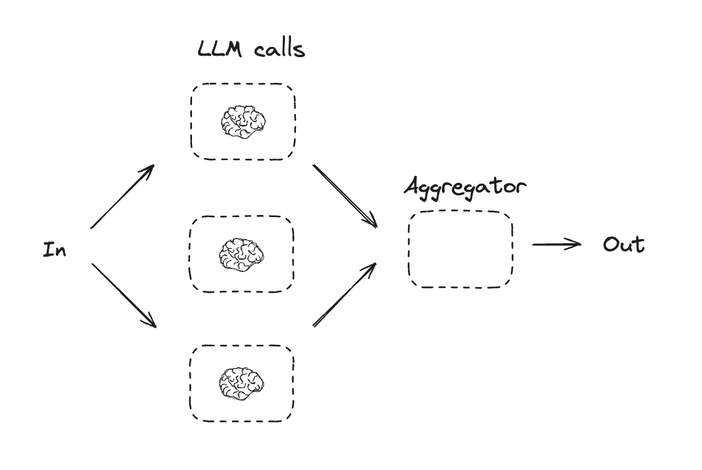
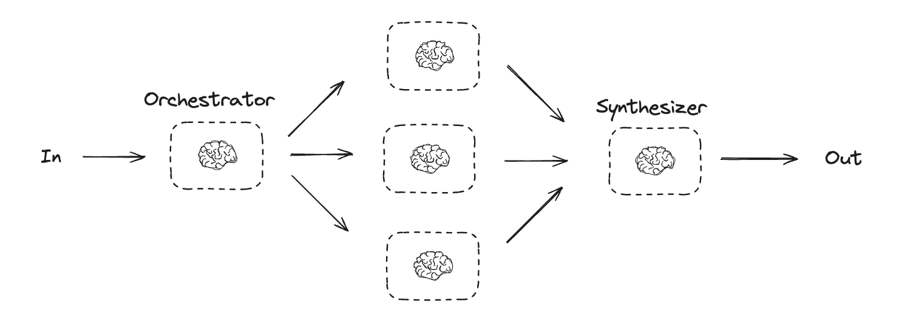
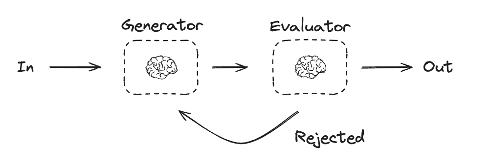
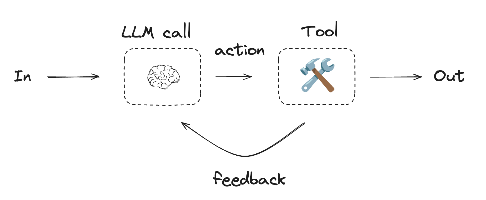

---
search:
  boost: 2
---

# Workflows and Agents

This guide reviews common patterns for agentic systems. In describing these systems, it can be useful to make a distinction between "workflows" and "agents". One way to think about this difference is nicely explained in Anthropic's `Building Effective Agents` blog post:

> Workflows are systems where LLMs and tools are orchestrated through predefined code paths.
> Agents, on the other hand, are systems where LLMs dynamically direct their own processes and tool usage, maintaining control over how they accomplish tasks.

Here is a simple way to visualize these differences:



When building agents and workflows, LangGraph offers a number of benefits including persistence, streaming, and support for debugging as well as deployment.

## Set up

:::python
You can use [any chat model](https://python.langchain.com/docs/integrations/chat/) that supports structured outputs and tool calling. Below, we show the process of installing the packages, setting API keys, and testing structured outputs / tool calling for Anthropic.

??? "Install dependencies"

    ```bash
    pip install langchain_core langchain-anthropic langgraph
    ```

Initialize an LLM

```python
import os
import getpass

from langchain_anthropic import ChatAnthropic

def _set_env(var: str):
    if not os.environ.get(var):
        os.environ[var] = getpass.getpass(f"{var}: ")


_set_env("ANTHROPIC_API_KEY")

llm = ChatAnthropic(model="claude-3-5-sonnet-latest")
```

:::

:::js
You can use [any chat model](https://js.langchain.com/docs/integrations/chat/) that supports structured outputs and tool calling. Below, we show the process of installing the packages, setting API keys, and testing structured outputs / tool calling for Anthropic.

??? "Install dependencies"

    ```bash
    npm install @langchain/core @langchain/anthropic @langchain/langgraph
    ```

Initialize an LLM

```typescript
import { ChatAnthropic } from "@langchain/anthropic";

process.env.ANTHROPIC_API_KEY = "YOUR_API_KEY";

const llm = new ChatAnthropic({ model: "claude-3-5-sonnet-latest" });
```

:::

## Building Blocks: The Augmented LLM

LLM have augmentations that support building workflows and agents. These include structured outputs and tool calling, as shown in this image from the Anthropic blog on `Building Effective Agents`:



:::python

```python
# Schema for structured output
from pydantic import BaseModel, Field

class SearchQuery(BaseModel):
    search_query: str = Field(None, description="Query that is optimized web search.")
    justification: str = Field(
        None, description="Why this query is relevant to the user's request."
    )


# Augment the LLM with schema for structured output
structured_llm = llm.with_structured_output(SearchQuery)

# Invoke the augmented LLM
output = structured_llm.invoke("How does Calcium CT score relate to high cholesterol?")

# Define a tool
def multiply(a: int, b: int) -> int:
    return a * b

# Augment the LLM with tools
llm_with_tools = llm.bind_tools([multiply])

# Invoke the LLM with input that triggers the tool call
msg = llm_with_tools.invoke("What is 2 times 3?")

# Get the tool call
msg.tool_calls
```

:::

:::js

```typescript
import { z } from "zod";
import { tool } from "@langchain/core/tools";

// Schema for structured output
const SearchQuery = z.object({
  search_query: z.string().describe("Query that is optimized web search."),
  justification: z
    .string()
    .describe("Why this query is relevant to the user's request."),
});

// Augment the LLM with schema for structured output
const structuredLlm = llm.withStructuredOutput(SearchQuery);

// Invoke the augmented LLM
const output = await structuredLlm.invoke(
  "How does Calcium CT score relate to high cholesterol?"
);

// Define a tool
const multiply = tool(
  async ({ a, b }: { a: number; b: number }) => {
    return a * b;
  },
  {
    name: "multiply",
    description: "Multiply two numbers",
    schema: z.object({
      a: z.number(),
      b: z.number(),
    }),
  }
);

// Augment the LLM with tools
const llmWithTools = llm.bindTools([multiply]);

// Invoke the LLM with input that triggers the tool call
const msg = await llmWithTools.invoke("What is 2 times 3?");

// Get the tool call
console.log(msg.tool_calls);
```

:::

## Prompt chaining

In prompt chaining, each LLM call processes the output of the previous one.

As noted in the Anthropic blog on `Building Effective Agents`:

> Prompt chaining decomposes a task into a sequence of steps, where each LLM call processes the output of the previous one. You can add programmatic checks (see "gate" in the diagram below) on any intermediate steps to ensure that the process is still on track.

> When to use this workflow: This workflow is ideal for situations where the task can be easily and cleanly decomposed into fixed subtasks. The main goal is to trade off latency for higher accuracy, by making each LLM call an easier task.



=== "Graph API"

    :::python
    ```python
    from typing_extensions import TypedDict
    from langgraph.graph import StateGraph, START, END
    from IPython.display import Image, display


    # Graph state
    class State(TypedDict):
        topic: str
        joke: str
        improved_joke: str
        final_joke: str


    # Nodes
    def generate_joke(state: State):
        """First LLM call to generate initial joke"""

        msg = llm.invoke(f"Write a short joke about {state['topic']}")
        return {"joke": msg.content}


    def check_punchline(state: State):
        """Gate function to check if the joke has a punchline"""

        # Simple check - does the joke contain "?" or "!"
        if "?" in state["joke"] or "!" in state["joke"]:
            return "Pass"
        return "Fail"


    def improve_joke(state: State):
        """Second LLM call to improve the joke"""

        msg = llm.invoke(f"Make this joke funnier by adding wordplay: {state['joke']}")
        return {"improved_joke": msg.content}


    def polish_joke(state: State):
        """Third LLM call for final polish"""

        msg = llm.invoke(f"Add a surprising twist to this joke: {state['improved_joke']}")
        return {"final_joke": msg.content}


    # Build workflow
    workflow = StateGraph(State)

    # Add nodes
    workflow.add_node("generate_joke", generate_joke)
    workflow.add_node("improve_joke", improve_joke)
    workflow.add_node("polish_joke", polish_joke)

    # Add edges to connect nodes
    workflow.add_edge(START, "generate_joke")
    workflow.add_conditional_edges(
        "generate_joke", check_punchline, {"Fail": "improve_joke", "Pass": END}
    )
    workflow.add_edge("improve_joke", "polish_joke")
    workflow.add_edge("polish_joke", END)

    # Compile
    chain = workflow.compile()

    # Show workflow
    display(Image(chain.get_graph().draw_mermaid_png()))

    # Invoke
    state = chain.invoke({"topic": "cats"})
    print("Initial joke:")
    print(state["joke"])
    print("\n--- --- ---\n")
    if "improved_joke" in state:
        print("Improved joke:")
        print(state["improved_joke"])
        print("\n--- --- ---\n")

        print("Final joke:")
        print(state["final_joke"])
    else:
        print("Joke failed quality gate - no punchline detected!")
    ```

    **LangSmith Trace**

    https://smith.langchain.com/public/a0281fca-3a71-46de-beee-791468607b75/r

    **Resources:**

    **LangChain Academy**

    See our lesson on Prompt Chaining [here](https://github.com/langchain-ai/langchain-academy/blob/main/module-1/chain.ipynb).
    :::

    :::js
    ```typescript
    import { StateGraph, START, END } from "@langchain/langgraph";
    import { z } from "zod";

    // Graph state
    const State = z.object({
      topic: z.string(),
      joke: z.string().optional(),
      improved_joke: z.string().optional(),
      final_joke: z.string().optional(),
    });

    // Nodes
    const generateJoke = async (state: z.infer<typeof State>) => {
      // First LLM call to generate initial joke
      const msg = await llm.invoke(`Write a short joke about ${state.topic}`);
      return { joke: msg.content };
    };

    const checkPunchline = (state: z.infer<typeof State>) => {
      // Gate function to check if the joke has a punchline
      // Simple check - does the joke contain "?" or "!"
      if (state.joke && (state.joke.includes("?") || state.joke.includes("!"))) {
        return "Pass";
      }
      return "Fail";
    };

    const improveJoke = async (state: z.infer<typeof State>) => {
      // Second LLM call to improve the joke
      const msg = await llm.invoke(`Make this joke funnier by adding wordplay: ${state.joke}`);
      return { improved_joke: msg.content };
    };

    const polishJoke = async (state: z.infer<typeof State>) => {
      // Third LLM call for final polish
      const msg = await llm.invoke(`Add a surprising twist to this joke: ${state.improved_joke}`);
      return { final_joke: msg.content };
    };

    // Build workflow
    const workflow = new StateGraph(State)
      .addNode("generate_joke", generateJoke)
      .addNode("improve_joke", improveJoke)
      .addNode("polish_joke", polishJoke)
      .addEdge(START, "generate_joke")
      .addConditionalEdges(
        "generate_joke",
        checkPunchline,
        { "Fail": "improve_joke", "Pass": END }
      )
      .addEdge("improve_joke", "polish_joke")
      .addEdge("polish_joke", END);

    // Compile
    const chain = workflow.compile();

    // Show workflow
    import * as fs from "node:fs/promises";
    const drawableGraph = await chain.getGraphAsync();
    const image = await drawableGraph.drawMermaidPng();
    const imageBuffer = new Uint8Array(await image.arrayBuffer());
    await fs.writeFile("workflow.png", imageBuffer);

    // Invoke
    const state = await chain.invoke({ topic: "cats" });
    console.log("Initial joke:");
    console.log(state.joke);
    console.log("\n--- --- ---\n");
    if (state.improved_joke) {
      console.log("Improved joke:");
      console.log(state.improved_joke);
      console.log("\n--- --- ---\n");

      console.log("Final joke:");
      console.log(state.final_joke);
    } else {
      console.log("Joke failed quality gate - no punchline detected!");
    }
    ```
    :::

=== "Functional API"

    :::python
    ```python
    from langgraph.func import entrypoint, task


    # Tasks
    @task
    def generate_joke(topic: str):
        """First LLM call to generate initial joke"""
        msg = llm.invoke(f"Write a short joke about {topic}")
        return msg.content


    def check_punchline(joke: str):
        """Gate function to check if the joke has a punchline"""
        # Simple check - does the joke contain "?" or "!"
        if "?" in joke or "!" in joke:
            return "Fail"

        return "Pass"


    @task
    def improve_joke(joke: str):
        """Second LLM call to improve the joke"""
        msg = llm.invoke(f"Make this joke funnier by adding wordplay: {joke}")
        return msg.content


    @task
    def polish_joke(joke: str):
        """Third LLM call for final polish"""
        msg = llm.invoke(f"Add a surprising twist to this joke: {joke}")
        return msg.content


    @entrypoint()
    def prompt_chaining_workflow(topic: str):
        original_joke = generate_joke(topic).result()
        if check_punchline(original_joke) == "Pass":
            return original_joke

        improved_joke = improve_joke(original_joke).result()
        return polish_joke(improved_joke).result()

    # Invoke
    for step in prompt_chaining_workflow.stream("cats", stream_mode="updates"):
        print(step)
        print("\n")
    ```

    **LangSmith Trace**

    https://smith.langchain.com/public/332fa4fc-b6ca-416e-baa3-161625e69163/r
    :::

    :::js
    ```typescript
    import { entrypoint, task } from "@langchain/langgraph";

    // Tasks
    const generateJoke = task("generate_joke", async (topic: string) => {
      // First LLM call to generate initial joke
      const msg = await llm.invoke(`Write a short joke about ${topic}`);
      return msg.content;
    });

    const checkPunchline = (joke: string) => {
      // Gate function to check if the joke has a punchline
      // Simple check - does the joke contain "?" or "!"
      if (joke.includes("?") || joke.includes("!")) {
        return "Pass";
      }
      return "Fail";
    };

    const improveJoke = task("improve_joke", async (joke: string) => {
      // Second LLM call to improve the joke
      const msg = await llm.invoke(`Make this joke funnier by adding wordplay: ${joke}`);
      return msg.content;
    });

    const polishJoke = task("polish_joke", async (joke: string) => {
      // Third LLM call for final polish
      const msg = await llm.invoke(`Add a surprising twist to this joke: ${joke}`);
      return msg.content;
    });

    const promptChainingWorkflow = entrypoint("promptChainingWorkflow", async (topic: string) => {
      const originalJoke = await generateJoke(topic);
      if (checkPunchline(originalJoke) === "Pass") {
        return originalJoke;
      }

      const improvedJoke = await improveJoke(originalJoke);
      return await polishJoke(improvedJoke);
    });

    // Invoke
    const stream = await promptChainingWorkflow.stream("cats", { streamMode: "updates" });
    for await (const step of stream) {
      console.log(step);
      console.log("\n");
    }
    ```
    :::

## Parallelization

With parallelization, LLMs work simultaneously on a task:

> LLMs can sometimes work simultaneously on a task and have their outputs aggregated programmatically. This workflow, parallelization, manifests in two key variations: Sectioning: Breaking a task into independent subtasks run in parallel. Voting: Running the same task multiple times to get diverse outputs.

> When to use this workflow: Parallelization is effective when the divided subtasks can be parallelized for speed, or when multiple perspectives or attempts are needed for higher confidence results. For complex tasks with multiple considerations, LLMs generally perform better when each consideration is handled by a separate LLM call, allowing focused attention on each specific aspect.



=== "Graph API"

    :::python
    ```python
    # Graph state
    class State(TypedDict):
        topic: str
        joke: str
        story: str
        poem: str
        combined_output: str


    # Nodes
    def call_llm_1(state: State):
        """First LLM call to generate initial joke"""

        msg = llm.invoke(f"Write a joke about {state['topic']}")
        return {"joke": msg.content}


    def call_llm_2(state: State):
        """Second LLM call to generate story"""

        msg = llm.invoke(f"Write a story about {state['topic']}")
        return {"story": msg.content}


    def call_llm_3(state: State):
        """Third LLM call to generate poem"""

        msg = llm.invoke(f"Write a poem about {state['topic']}")
        return {"poem": msg.content}


    def aggregator(state: State):
        """Combine the joke and story into a single output"""

        combined = f"Here's a story, joke, and poem about {state['topic']}!\n\n"
        combined += f"STORY:\n{state['story']}\n\n"
        combined += f"JOKE:\n{state['joke']}\n\n"
        combined += f"POEM:\n{state['poem']}"
        return {"combined_output": combined}


    # Build workflow
    parallel_builder = StateGraph(State)

    # Add nodes
    parallel_builder.add_node("call_llm_1", call_llm_1)
    parallel_builder.add_node("call_llm_2", call_llm_2)
    parallel_builder.add_node("call_llm_3", call_llm_3)
    parallel_builder.add_node("aggregator", aggregator)

    # Add edges to connect nodes
    parallel_builder.add_edge(START, "call_llm_1")
    parallel_builder.add_edge(START, "call_llm_2")
    parallel_builder.add_edge(START, "call_llm_3")
    parallel_builder.add_edge("call_llm_1", "aggregator")
    parallel_builder.add_edge("call_llm_2", "aggregator")
    parallel_builder.add_edge("call_llm_3", "aggregator")
    parallel_builder.add_edge("aggregator", END)
    parallel_workflow = parallel_builder.compile()

    # Show workflow
    display(Image(parallel_workflow.get_graph().draw_mermaid_png()))

    # Invoke
    state = parallel_workflow.invoke({"topic": "cats"})
    print(state["combined_output"])
    ```

    **LangSmith Trace**

    https://smith.langchain.com/public/3be2e53c-ca94-40dd-934f-82ff87fac277/r

    **Resources:**

    **Documentation**

    See our documentation on parallelization [here](https://langchain-ai.github.io/langgraph/how-tos/branching/).

    **LangChain Academy**

    See our lesson on parallelization [here](https://github.com/langchain-ai/langchain-academy/blob/main/module-1/simple-graph.ipynb).
    :::

    :::js
    ```typescript
    // Graph state
    const State = z.object({
      topic: z.string(),
      joke: z.string().optional(),
      story: z.string().optional(),
      poem: z.string().optional(),
      combined_output: z.string().optional(),
    });

    // Nodes
    const callLlm1 = async (state: z.infer<typeof State>) => {
      // First LLM call to generate initial joke
      const msg = await llm.invoke(`Write a joke about ${state.topic}`);
      return { joke: msg.content };
    };

    const callLlm2 = async (state: z.infer<typeof State>) => {
      // Second LLM call to generate story
      const msg = await llm.invoke(`Write a story about ${state.topic}`);
      return { story: msg.content };
    };

    const callLlm3 = async (state: z.infer<typeof State>) => {
      // Third LLM call to generate poem
      const msg = await llm.invoke(`Write a poem about ${state.topic}`);
      return { poem: msg.content };
    };

    const aggregator = (state: z.infer<typeof State>) => {
      // Combine the joke and story into a single output
      let combined = `Here's a story, joke, and poem about ${state.topic}!\n\n`;
      combined += `STORY:\n${state.story}\n\n`;
      combined += `JOKE:\n${state.joke}\n\n`;
      combined += `POEM:\n${state.poem}`;
      return { combined_output: combined };
    };

    // Build workflow
    const parallelBuilder = new StateGraph(State)
      .addNode("call_llm_1", callLlm1)
      .addNode("call_llm_2", callLlm2)
      .addNode("call_llm_3", callLlm3)
      .addNode("aggregator", aggregator)
      .addEdge(START, "call_llm_1")
      .addEdge(START, "call_llm_2")
      .addEdge(START, "call_llm_3")
      .addEdge("call_llm_1", "aggregator")
      .addEdge("call_llm_2", "aggregator")
      .addEdge("call_llm_3", "aggregator")
      .addEdge("aggregator", END);

    const parallelWorkflow = parallelBuilder.compile();

    // Invoke
    const state = await parallelWorkflow.invoke({ topic: "cats" });
    console.log(state.combined_output);
    ```
    :::

=== "Functional API"

    :::python
    ```python
    @task
    def call_llm_1(topic: str):
        """First LLM call to generate initial joke"""
        msg = llm.invoke(f"Write a joke about {topic}")
        return msg.content


    @task
    def call_llm_2(topic: str):
        """Second LLM call to generate story"""
        msg = llm.invoke(f"Write a story about {topic}")
        return msg.content


    @task
    def call_llm_3(topic):
        """Third LLM call to generate poem"""
        msg = llm.invoke(f"Write a poem about {topic}")
        return msg.content


    @task
    def aggregator(topic, joke, story, poem):
        """Combine the joke and story into a single output"""

        combined = f"Here's a story, joke, and poem about {topic}!\n\n"
        combined += f"STORY:\n{story}\n\n"
        combined += f"JOKE:\n{joke}\n\n"
        combined += f"POEM:\n{poem}"
        return combined


    # Build workflow
    @entrypoint()
    def parallel_workflow(topic: str):
        joke_fut = call_llm_1(topic)
        story_fut = call_llm_2(topic)
        poem_fut = call_llm_3(topic)
        return aggregator(
            topic, joke_fut.result(), story_fut.result(), poem_fut.result()
        ).result()

    # Invoke
    for step in parallel_workflow.stream("cats", stream_mode="updates"):
        print(step)
        print("\n")
    ```

    **LangSmith Trace**

    https://smith.langchain.com/public/623d033f-e814-41e9-80b1-75e6abb67801/r
    :::

    :::js
    ```typescript
    const callLlm1 = task("call_llm_1", async (topic: string) => {
      // First LLM call to generate initial joke
      const msg = await llm.invoke(`Write a joke about ${topic}`);
      return msg.content;
    });

    const callLlm2 = task("call_llm_2", async (topic: string) => {
      // Second LLM call to generate story
      const msg = await llm.invoke(`Write a story about ${topic}`);
      return msg.content;
    });

    const callLlm3 = task("call_llm_3", async (topic: string) => {
      // Third LLM call to generate poem
      const msg = await llm.invoke(`Write a poem about ${topic}`);
      return msg.content;
    });

    const aggregator = task("aggregator", (topic: string, joke: string, story: string, poem: string) => {
      // Combine the joke and story into a single output
      let combined = `Here's a story, joke, and poem about ${topic}!\n\n`;
      combined += `STORY:\n${story}\n\n`;
      combined += `JOKE:\n${joke}\n\n`;
      combined += `POEM:\n${poem}`;
      return combined;
    });

    // Build workflow
    const parallelWorkflow = entrypoint("parallelWorkflow", async (topic: string) => {
      const jokeFut = callLlm1(topic);
      const storyFut = callLlm2(topic);
      const poemFut = callLlm3(topic);

      return await aggregator(
        topic,
        await jokeFut,
        await storyFut,
        await poemFut
      );
    });

    // Invoke
    const stream = await parallelWorkflow.stream("cats", { streamMode: "updates" });
    for await (const step of stream) {
      console.log(step);
      console.log("\n");
    }
    ```
    :::

## Routing

Routing classifies an input and directs it to a followup task. As noted in the Anthropic blog on `Building Effective Agents`:

> Routing classifies an input and directs it to a specialized followup task. This workflow allows for separation of concerns, and building more specialized prompts. Without this workflow, optimizing for one kind of input can hurt performance on other inputs.

> When to use this workflow: Routing works well for complex tasks where there are distinct categories that are better handled separately, and where classification can be handled accurately, either by an LLM or a more traditional classification model/algorithm.


=== "Graph API"

    :::python
    ```python
    from typing_extensions import Literal
    from langchain_core.messages import HumanMessage, SystemMessage


    # Schema for structured output to use as routing logic
    class Route(BaseModel):
        step: Literal["poem", "story", "joke"] = Field(
            None, description="The next step in the routing process"
        )


    # Augment the LLM with schema for structured output
    router = llm.with_structured_output(Route)


    # State
    class State(TypedDict):
        input: str
        decision: str
        output: str


    # Nodes
    def llm_call_1(state: State):
        """Write a story"""

        result = llm.invoke(state["input"])
        return {"output": result.content}


    def llm_call_2(state: State):
        """Write a joke"""

        result = llm.invoke(state["input"])
        return {"output": result.content}


    def llm_call_3(state: State):
        """Write a poem"""

        result = llm.invoke(state["input"])
        return {"output": result.content}


    def llm_call_router(state: State):
        """Route the input to the appropriate node"""

        # Run the augmented LLM with structured output to serve as routing logic
        decision = router.invoke(
            [
                SystemMessage(
                    content="Route the input to story, joke, or poem based on the user's request."
                ),
                HumanMessage(content=state["input"]),
            ]
        )

        return {"decision": decision.step}


    # Conditional edge function to route to the appropriate node
    def route_decision(state: State):
        # Return the node name you want to visit next
        if state["decision"] == "story":
            return "llm_call_1"
        elif state["decision"] == "joke":
            return "llm_call_2"
        elif state["decision"] == "poem":
            return "llm_call_3"


    # Build workflow
    router_builder = StateGraph(State)

    # Add nodes
    router_builder.add_node("llm_call_1", llm_call_1)
    router_builder.add_node("llm_call_2", llm_call_2)
    router_builder.add_node("llm_call_3", llm_call_3)
    router_builder.add_node("llm_call_router", llm_call_router)

    # Add edges to connect nodes
    router_builder.add_edge(START, "llm_call_router")
    router_builder.add_conditional_edges(
        "llm_call_router",
        route_decision,
        {  # Name returned by route_decision : Name of next node to visit
            "llm_call_1": "llm_call_1",
            "llm_call_2": "llm_call_2",
            "llm_call_3": "llm_call_3",
        },
    )
    router_builder.add_edge("llm_call_1", END)
    router_builder.add_edge("llm_call_2", END)
    router_builder.add_edge("llm_call_3", END)

    # Compile workflow
    router_workflow = router_builder.compile()

    # Show the workflow
    display(Image(router_workflow.get_graph().draw_mermaid_png()))

    # Invoke
    state = router_workflow.invoke({"input": "Write me a joke about cats"})
    print(state["output"])
    ```

    **LangSmith Trace**

    https://smith.langchain.com/public/c4580b74-fe91-47e4-96fe-7fac598d509c/r

    **Resources:**

    **LangChain Academy**

    See our lesson on routing [here](https://github.com/langchain-ai/langchain-academy/blob/main/module-1/router.ipynb).

    **Examples**

    [Here](https://langchain-ai.github.io/langgraph/tutorials/rag/langgraph_adaptive_rag_local/) is RAG workflow that routes questions. See our video [here](https://www.youtube.com/watch?v=bq1Plo2RhYI).
    :::

    :::js
    ```typescript
    import { SystemMessage, HumanMessage } from "@langchain/core/messages";

    // Schema for structured output to use as routing logic
    const Route = z.object({
      step: z.enum(["poem", "story", "joke"]).describe("The next step in the routing process"),
    });

    // Augment the LLM with schema for structured output
    const router = llm.withStructuredOutput(Route);

    // State
    const State = z.object({
      input: z.string(),
      decision: z.string().optional(),
      output: z.string().optional(),
    });

    // Nodes
    const llmCall1 = async (state: z.infer<typeof State>) => {
      // Write a story
      const result = await llm.invoke(state.input);
      return { output: result.content };
    };

    const llmCall2 = async (state: z.infer<typeof State>) => {
      // Write a joke
      const result = await llm.invoke(state.input);
      return { output: result.content };
    };

    const llmCall3 = async (state: z.infer<typeof State>) => {
      // Write a poem
      const result = await llm.invoke(state.input);
      return { output: result.content };
    };

    const llmCallRouter = async (state: z.infer<typeof State>) => {
      // Route the input to the appropriate node
      const decision = await router.invoke([
        new SystemMessage("Route the input to story, joke, or poem based on the user's request."),
        new HumanMessage(state.input),
      ]);

      return { decision: decision.step };
    };

    // Conditional edge function to route to the appropriate node
    const routeDecision = (state: z.infer<typeof State>) => {
      // Return the node name you want to visit next
      if (state.decision === "story") {
        return "llm_call_1";
      } else if (state.decision === "joke") {
        return "llm_call_2";
      } else if (state.decision === "poem") {
        return "llm_call_3";
      }
    };

    // Build workflow
    const routerBuilder = new StateGraph(State)
      .addNode("llm_call_1", llmCall1)
      .addNode("llm_call_2", llmCall2)
      .addNode("llm_call_3", llmCall3)
      .addNode("llm_call_router", llmCallRouter)
      .addEdge(START, "llm_call_router")
      .addConditionalEdges(
        "llm_call_router",
        routeDecision,
        {
          "llm_call_1": "llm_call_1",
          "llm_call_2": "llm_call_2",
          "llm_call_3": "llm_call_3",
        }
      )
      .addEdge("llm_call_1", END)
      .addEdge("llm_call_2", END)
      .addEdge("llm_call_3", END);

    const routerWorkflow = routerBuilder.compile();

    // Invoke
    const state = await routerWorkflow.invoke({ input: "Write me a joke about cats" });
    console.log(state.output);
    ```
    :::

=== "Functional API"

    :::python
    ```python
    from typing_extensions import Literal
    from pydantic import BaseModel
    from langchain_core.messages import HumanMessage, SystemMessage


    # Schema for structured output to use as routing logic
    class Route(BaseModel):
        step: Literal["poem", "story", "joke"] = Field(
            None, description="The next step in the routing process"
        )


    # Augment the LLM with schema for structured output
    router = llm.with_structured_output(Route)


    @task
    def llm_call_1(input_: str):
        """Write a story"""
        result = llm.invoke(input_)
        return result.content


    @task
    def llm_call_2(input_: str):
        """Write a joke"""
        result = llm.invoke(input_)
        return result.content


    @task
    def llm_call_3(input_: str):
        """Write a poem"""
        result = llm.invoke(input_)
        return result.content


    def llm_call_router(input_: str):
        """Route the input to the appropriate node"""
        # Run the augmented LLM with structured output to serve as routing logic
        decision = router.invoke(
            [
                SystemMessage(
                    content="Route the input to story, joke, or poem based on the user's request."
                ),
                HumanMessage(content=input_),
            ]
        )
        return decision.step


    # Create workflow
    @entrypoint()
    def router_workflow(input_: str):
        next_step = llm_call_router(input_)
        if next_step == "story":
            llm_call = llm_call_1
        elif next_step == "joke":
            llm_call = llm_call_2
        elif next_step == "poem":
            llm_call = llm_call_3

        return llm_call(input_).result()

    # Invoke
    for step in router_workflow.stream("Write me a joke about cats", stream_mode="updates"):
        print(step)
        print("\n")
    ```

    **LangSmith Trace**

    https://smith.langchain.com/public/5e2eb979-82dd-402c-b1a0-a8cceaf2a28a/r
    :::

    :::js
    ```typescript
    import { SystemMessage, HumanMessage } from "@langchain/core/messages";

    // Schema for structured output to use as routing logic
    const Route = z.object({
      step: z.enum(["poem", "story", "joke"]).describe(
        "The next step in the routing process"
      ),
    });

    // Augment the LLM with schema for structured output
    const router = llm.withStructuredOutput(Route);

    const llmCall1 = task("llm_call_1", async (input: string) => {
      // Write a story
      const result = await llm.invoke(input);
      return result.content;
    });

    const llmCall2 = task("llm_call_2", async (input: string) => {
      // Write a joke
      const result = await llm.invoke(input);
      return result.content;
    });

    const llmCall3 = task("llm_call_3", async (input: string) => {
      // Write a poem
      const result = await llm.invoke(input);
      return result.content;
    });

    const llmCallRouter = async (input: string) => {
      // Route the input to the appropriate node
      const decision = await router.invoke([
        new SystemMessage("Route the input to story, joke, or poem based on the user's request."),
        new HumanMessage(input),
      ]);
      return decision.step;
    };

    // Create workflow
    const routerWorkflow = entrypoint("routerWorkflow", async (input: string) => {
      const nextStep = await llmCallRouter(input);

      let llmCall: typeof llmCall1;
      if (nextStep === "story") {
        llmCall = llmCall1;
      } else if (nextStep === "joke") {
        llmCall = llmCall2;
      } else if (nextStep === "poem") {
        llmCall = llmCall3;
      }

      return await llmCall(input);
    });

    // Invoke
    const stream = await routerWorkflow.stream("Write me a joke about cats", { streamMode: "updates" });
    for await (const step of stream) {
      console.log(step);
      console.log("\n");
    }
    ```
    :::

## Orchestrator-Worker

With orchestrator-worker, an orchestrator breaks down a task and delegates each sub-task to workers. As noted in the Anthropic blog on `Building Effective Agents`:

> In the orchestrator-workers workflow, a central LLM dynamically breaks down tasks, delegates them to worker LLMs, and synthesizes their results.

> When to use this workflow: This workflow is well-suited for complex tasks where you can't predict the subtasks needed (in coding, for example, the number of files that need to be changed and the nature of the change in each file likely depend on the task). Whereas it's topographically similar, the key difference from parallelization is its flexibility—subtasks aren't pre-defined, but determined by the orchestrator based on the specific input.



=== "Graph API"

    :::python
    ```python
    from typing import Annotated, List
    import operator


    # Schema for structured output to use in planning
    class Section(BaseModel):
        name: str = Field(
            description="Name for this section of the report.",
        )
        description: str = Field(
            description="Brief overview of the main topics and concepts to be covered in this section.",
        )


    class Sections(BaseModel):
        sections: List[Section] = Field(
            description="Sections of the report.",
        )


    # Augment the LLM with schema for structured output
    planner = llm.with_structured_output(Sections)
    ```

    **Creating Workers in LangGraph**

    Because orchestrator-worker workflows are common, LangGraph **has the `Send` API to support this**. It lets you dynamically create worker nodes and send each one a specific input. Each worker has its own state, and all worker outputs are written to a *shared state key* that is accessible to the orchestrator graph. This gives the orchestrator access to all worker output and allows it to synthesize them into a final output. As you can see below, we iterate over a list of sections and `Send` each to a worker node. See further documentation [here](https://langchain-ai.github.io/langgraph/how-tos/map-reduce/) and [here](https://langchain-ai.github.io/langgraph/concepts/low_level/#send).

    ```python
    from langgraph.types import Send


    # Graph state
    class State(TypedDict):
        topic: str  # Report topic
        sections: list[Section]  # List of report sections
        completed_sections: Annotated[
            list, operator.add
        ]  # All workers write to this key in parallel
        final_report: str  # Final report


    # Worker state
    class WorkerState(TypedDict):
        section: Section
        completed_sections: Annotated[list, operator.add]


    # Nodes
    def orchestrator(state: State):
        """Orchestrator that generates a plan for the report"""

        # Generate queries
        report_sections = planner.invoke(
            [
                SystemMessage(content="Generate a plan for the report."),
                HumanMessage(content=f"Here is the report topic: {state['topic']}"),
            ]
        )

        return {"sections": report_sections.sections}


    def llm_call(state: WorkerState):
        """Worker writes a section of the report"""

        # Generate section
        section = llm.invoke(
            [
                SystemMessage(
                    content="Write a report section following the provided name and description. Include no preamble for each section. Use markdown formatting."
                ),
                HumanMessage(
                    content=f"Here is the section name: {state['section'].name} and description: {state['section'].description}"
                ),
            ]
        )

        # Write the updated section to completed sections
        return {"completed_sections": [section.content]}


    def synthesizer(state: State):
        """Synthesize full report from sections"""

        # List of completed sections
        completed_sections = state["completed_sections"]

        # Format completed section to str to use as context for final sections
        completed_report_sections = "\n\n---\n\n".join(completed_sections)

        return {"final_report": completed_report_sections}


    # Conditional edge function to create llm_call workers that each write a section of the report
    def assign_workers(state: State):
        """Assign a worker to each section in the plan"""

        # Kick off section writing in parallel via Send() API
        return [Send("llm_call", {"section": s}) for s in state["sections"]]


    # Build workflow
    orchestrator_worker_builder = StateGraph(State)

    # Add the nodes
    orchestrator_worker_builder.add_node("orchestrator", orchestrator)
    orchestrator_worker_builder.add_node("llm_call", llm_call)
    orchestrator_worker_builder.add_node("synthesizer", synthesizer)

    # Add edges to connect nodes
    orchestrator_worker_builder.add_edge(START, "orchestrator")
    orchestrator_worker_builder.add_conditional_edges(
        "orchestrator", assign_workers, ["llm_call"]
    )
    orchestrator_worker_builder.add_edge("llm_call", "synthesizer")
    orchestrator_worker_builder.add_edge("synthesizer", END)

    # Compile the workflow
    orchestrator_worker = orchestrator_worker_builder.compile()

    # Show the workflow
    display(Image(orchestrator_worker.get_graph().draw_mermaid_png()))

    # Invoke
    state = orchestrator_worker.invoke({"topic": "Create a report on LLM scaling laws"})

    from IPython.display import Markdown
    Markdown(state["final_report"])
    ```

    **LangSmith Trace**

    https://smith.langchain.com/public/78cbcfc3-38bf-471d-b62a-b299b144237d/r

    **Resources:**

    **LangChain Academy**

    See our lesson on orchestrator-worker [here](https://github.com/langchain-ai/langchain-academy/blob/main/module-4/map-reduce.ipynb).

    **Examples**

    [Here](https://github.com/langchain-ai/report-mAIstro) is a project that uses orchestrator-worker for report planning and writing. See our video [here](https://www.youtube.com/watch?v=wSxZ7yFbbas).
    :::

    :::js
    ```typescript
    import "@langchain/langgraph/zod";

    // Schema for structured output to use in planning
    const Section = z.object({
      name: z.string().describe("Name for this section of the report."),
      description: z.string().describe("Brief overview of the main topics and concepts to be covered in this section."),
    });

    const Sections = z.object({
      sections: z.array(Section).describe("Sections of the report."),
    });

    // Augment the LLM with schema for structured output
    const planner = llm.withStructuredOutput(Sections);
    ```

    **Creating Workers in LangGraph**

    Because orchestrator-worker workflows are common, LangGraph **has the `Send` API to support this**. It lets you dynamically create worker nodes and send each one a specific input. Each worker has its own state, and all worker outputs are written to a *shared state key* that is accessible to the orchestrator graph. This gives the orchestrator access to all worker output and allows it to synthesize them into a final output. As you can see below, we iterate over a list of sections and `Send` each to a worker node. See further documentation [here](https://langchain-ai.github.io/langgraph/how-tos/map-reduce/) and [here](https://langchain-ai.github.io/langgraph/concepts/low_level/#send).

    ```typescript
    import { withLangGraph } from "@langchain/langgraph/zod";
    import { Send } from "@langchain/langgraph";

    // Graph state
    const State = z.object({
      topic: z.string(), // Report topic
      sections: z.array(Section).optional(), // List of report sections
      // All workers write to this key
      completed_sections: withLangGraph(z.array(z.string()), {
        reducer: {
          fn: (x, y) => x.concat(y),
        },
        default: () => [],
      }),
      final_report: z.string().optional(), // Final report
    });

    // Worker state
    const WorkerState = z.object({
      section: Section,
      completed_sections: withLangGraph(z.array(z.string()), {
        reducer: {
          fn: (x, y) => x.concat(y),
        },
        default: () => [],
      }),
    });

    // Nodes
    const orchestrator = async (state: z.infer<typeof State>) => {
      // Orchestrator that generates a plan for the report
      const reportSections = await planner.invoke([
        new SystemMessage("Generate a plan for the report."),
        new HumanMessage(`Here is the report topic: ${state.topic}`),
      ]);

      return { sections: reportSections.sections };
    };

    const llmCall = async (state: z.infer<typeof WorkerState>) => {
      // Worker writes a section of the report
      const section = await llm.invoke([
        new SystemMessage(
          "Write a report section following the provided name and description. Include no preamble for each section. Use markdown formatting."
        ),
        new HumanMessage(
          `Here is the section name: ${state.section.name} and description: ${state.section.description}`
        ),
      ]);

      // Write the updated section to completed sections
      return { completed_sections: [section.content] };
    };

    const synthesizer = (state: z.infer<typeof State>) => {
      // Synthesize full report from sections
      const completedSections = state.completed_sections;
      const completedReportSections = completedSections.join("\n\n---\n\n");
      return { final_report: completedReportSections };
    };

    // Conditional edge function to create llm_call workers
    const assignWorkers = (state: z.infer<typeof State>) => {
      // Assign a worker to each section in the plan
      return state.sections!.map((s) => new Send("llm_call", { section: s }));
    };

    // Build workflow
    const orchestratorWorkerBuilder = new StateGraph(State)
      .addNode("orchestrator", orchestrator)
      .addNode("llm_call", llmCall)
      .addNode("synthesizer", synthesizer)
      .addEdge(START, "orchestrator")
      .addConditionalEdges("orchestrator", assignWorkers, ["llm_call"])
      .addEdge("llm_call", "synthesizer")
      .addEdge("synthesizer", END);

    // Compile the workflow
    const orchestratorWorker = orchestratorWorkerBuilder.compile();

    // Invoke
    const state = await orchestratorWorker.invoke({ topic: "Create a report on LLM scaling laws" });
    console.log(state.final_report);
    ```
    :::

=== "Functional API"

    :::python
    ```python
    from typing import List


    # Schema for structured output to use in planning
    class Section(BaseModel):
        name: str = Field(
            description="Name for this section of the report.",
        )
        description: str = Field(
            description="Brief overview of the main topics and concepts to be covered in this section.",
        )


    class Sections(BaseModel):
        sections: List[Section] = Field(
            description="Sections of the report.",
        )


    # Augment the LLM with schema for structured output
    planner = llm.with_structured_output(Sections)


    @task
    def orchestrator(topic: str):
        """Orchestrator that generates a plan for the report"""
        # Generate queries
        report_sections = planner.invoke(
            [
                SystemMessage(content="Generate a plan for the report."),
                HumanMessage(content=f"Here is the report topic: {topic}"),
            ]
        )

        return report_sections.sections


    @task
    def llm_call(section: Section):
        """Worker writes a section of the report"""

        # Generate section
        result = llm.invoke(
            [
                SystemMessage(content="Write a report section."),
                HumanMessage(
                    content=f"Here is the section name: {section.name} and description: {section.description}"
                ),
            ]
        )

        # Write the updated section to completed sections
        return result.content


    @task
    def synthesizer(completed_sections: list[str]):
        """Synthesize full report from sections"""
        final_report = "\n\n---\n\n".join(completed_sections)
        return final_report


    @entrypoint()
    def orchestrator_worker(topic: str):
        sections = orchestrator(topic).result()
        section_futures = [llm_call(section) for section in sections]
        final_report = synthesizer(
            [section_fut.result() for section_fut in section_futures]
        ).result()
        return final_report

    # Invoke
    report = orchestrator_worker.invoke("Create a report on LLM scaling laws")
    from IPython.display import Markdown
    Markdown(report)
    ```

    **LangSmith Trace**

    https://smith.langchain.com/public/75a636d0-6179-4a12-9836-e0aa571e87c5/r
    :::

    :::js
    ```typescript
    // Schema for structured output to use in planning
    const Section = z.object({
      name: z.string().describe("Name for this section of the report."),
      description: z.string().describe("Brief overview of the main topics and concepts to be covered in this section."),
    });

    const Sections = z.object({
      sections: z.array(Section).describe("Sections of the report."),
    });

    // Augment the LLM with schema for structured output
    const planner = llm.withStructuredOutput(Sections);

    const orchestrator = task("orchestrator", async (topic: string) => {
      // Orchestrator that generates a plan for the report
      const reportSections = await planner.invoke([
        new SystemMessage("Generate a plan for the report."),
        new HumanMessage(`Here is the report topic: ${topic}`),
      ]);
      return reportSections.sections;
    });

    const llmCall = task("llm_call", async (section: z.infer<typeof Section>) => {
      // Worker writes a section of the report
      const result = await llm.invoke([
        new SystemMessage("Write a report section."),
        new HumanMessage(
          `Here is the section name: ${section.name} and description: ${section.description}`
        ),
      ]);
      return result.content;
    });

    const synthesizer = task("synthesizer", (completedSections: string[]) => {
      // Synthesize full report from sections
      const finalReport = completedSections.join("\n\n---\n\n");
      return finalReport;
    });

    const orchestratorWorker = entrypoint("orchestratorWorker", async (topic: string) => {
      const sections = await orchestrator(topic);
      const sectionFutures = sections.map((section) => llmCall(section));
      const finalReport = await synthesizer(
        await Promise.all(sectionFutures)
      );
      return finalReport;
    });

    // Invoke
    const report = await orchestratorWorker.invoke("Create a report on LLM scaling laws");
    console.log(report);
    ```
    :::

## Evaluator-optimizer

In the evaluator-optimizer workflow, one LLM call generates a response while another provides evaluation and feedback in a loop:

> When to use this workflow: This workflow is particularly effective when we have clear evaluation criteria, and when iterative refinement provides measurable value. The two signs of good fit are, first, that LLM responses can be demonstrably improved when a human articulates their feedback; and second, that the LLM can provide such feedback. This is analogous to the iterative writing process a human writer might go through when producing a polished document.



=== "Graph API"

    :::python
    ```python
    # Graph state
    class State(TypedDict):
        joke: str
        topic: str
        feedback: str
        funny_or_not: str


    # Schema for structured output to use in evaluation
    class Feedback(BaseModel):
        grade: Literal["funny", "not funny"] = Field(
            description="Decide if the joke is funny or not.",
        )
        feedback: str = Field(
            description="If the joke is not funny, provide feedback on how to improve it.",
        )


    # Augment the LLM with schema for structured output
    evaluator = llm.with_structured_output(Feedback)


    # Nodes
    def llm_call_generator(state: State):
        """LLM generates a joke"""

        if state.get("feedback"):
            msg = llm.invoke(
                f"Write a joke about {state['topic']} but take into account the feedback: {state['feedback']}"
            )
        else:
            msg = llm.invoke(f"Write a joke about {state['topic']}")
        return {"joke": msg.content}


    def llm_call_evaluator(state: State):
        """LLM evaluates the joke"""

        grade = evaluator.invoke(f"Grade the joke {state['joke']}")
        return {"funny_or_not": grade.grade, "feedback": grade.feedback}


    # Conditional edge function to route back to joke generator or end based upon feedback from the evaluator
    def route_joke(state: State):
        """Route back to joke generator or end based upon feedback from the evaluator"""

        if state["funny_or_not"] == "funny":
            return "Accepted"
        elif state["funny_or_not"] == "not funny":
            return "Rejected + Feedback"


    # Build workflow
    optimizer_builder = StateGraph(State)

    # Add the nodes
    optimizer_builder.add_node("llm_call_generator", llm_call_generator)
    optimizer_builder.add_node("llm_call_evaluator", llm_call_evaluator)

    # Add edges to connect nodes
    optimizer_builder.add_edge(START, "llm_call_generator")
    optimizer_builder.add_edge("llm_call_generator", "llm_call_evaluator")
    optimizer_builder.add_conditional_edges(
        "llm_call_evaluator",
        route_joke,
        {  # Name returned by route_joke : Name of next node to visit
            "Accepted": END,
            "Rejected + Feedback": "llm_call_generator",
        },
    )

    # Compile the workflow
    optimizer_workflow = optimizer_builder.compile()

    # Show the workflow
    display(Image(optimizer_workflow.get_graph().draw_mermaid_png()))

    # Invoke
    state = optimizer_workflow.invoke({"topic": "Cats"})
    print(state["joke"])
    ```

    **LangSmith Trace**

    https://smith.langchain.com/public/86ab3e60-2000-4bff-b988-9b89a3269789/r

    **Resources:**

    **Examples**

    [Here](https://github.com/langchain-ai/local-deep-researcher) is an assistant that uses evaluator-optimizer to improve a report. See our video [here](https://www.youtube.com/watch?v=XGuTzHoqlj8).

    [Here](https://langchain-ai.github.io/langgraph/tutorials/rag/langgraph_adaptive_rag_local/) is a RAG workflow that grades answers for hallucinations or errors. See our video [here](https://www.youtube.com/watch?v=bq1Plo2RhYI).
    :::

    :::js
    ```typescript
    // Graph state
    const State = z.object({
      joke: z.string().optional(),
      topic: z.string(),
      feedback: z.string().optional(),
      funny_or_not: z.string().optional(),
    });

    // Schema for structured output to use in evaluation
    const Feedback = z.object({
      grade: z.enum(["funny", "not funny"]).describe("Decide if the joke is funny or not."),
      feedback: z.string().describe("If the joke is not funny, provide feedback on how to improve it."),
    });

    // Augment the LLM with schema for structured output
    const evaluator = llm.withStructuredOutput(Feedback);

    // Nodes
    const llmCallGenerator = async (state: z.infer<typeof State>) => {
      // LLM generates a joke
      let msg;
      if (state.feedback) {
        msg = await llm.invoke(
          `Write a joke about ${state.topic} but take into account the feedback: ${state.feedback}`
        );
      } else {
        msg = await llm.invoke(`Write a joke about ${state.topic}`);
      }
      return { joke: msg.content };
    };

    const llmCallEvaluator = async (state: z.infer<typeof State>) => {
      // LLM evaluates the joke
      const grade = await evaluator.invoke(`Grade the joke ${state.joke}`);
      return { funny_or_not: grade.grade, feedback: grade.feedback };
    };

    // Conditional edge function to route back to joke generator or end
    const routeJoke = (state: z.infer<typeof State>) => {
      // Route back to joke generator or end based upon feedback from the evaluator
      if (state.funny_or_not === "funny") {
        return "Accepted";
      } else if (state.funny_or_not === "not funny") {
        return "Rejected + Feedback";
      }
    };

    // Build workflow
    const optimizerBuilder = new StateGraph(State)
      .addNode("llm_call_generator", llmCallGenerator)
      .addNode("llm_call_evaluator", llmCallEvaluator)
      .addEdge(START, "llm_call_generator")
      .addEdge("llm_call_generator", "llm_call_evaluator")
      .addConditionalEdges(
        "llm_call_evaluator",
        routeJoke,
        {
          "Accepted": END,
          "Rejected + Feedback": "llm_call_generator",
        }
      );

    // Compile the workflow
    const optimizerWorkflow = optimizerBuilder.compile();

    // Invoke
    const state = await optimizerWorkflow.invoke({ topic: "Cats" });
    console.log(state.joke);
    ```
    :::

=== "Functional API"

    :::python
    ```python
    # Schema for structured output to use in evaluation
    class Feedback(BaseModel):
        grade: Literal["funny", "not funny"] = Field(
            description="Decide if the joke is funny or not.",
        )
        feedback: str = Field(
            description="If the joke is not funny, provide feedback on how to improve it.",
        )


    # Augment the LLM with schema for structured output
    evaluator = llm.with_structured_output(Feedback)


    # Nodes
    @task
    def llm_call_generator(topic: str, feedback: Feedback):
        """LLM generates a joke"""
        if feedback:
            msg = llm.invoke(
                f"Write a joke about {topic} but take into account the feedback: {feedback}"
            )
        else:
            msg = llm.invoke(f"Write a joke about {topic}")
        return msg.content


    @task
    def llm_call_evaluator(joke: str):
        """LLM evaluates the joke"""
        feedback = evaluator.invoke(f"Grade the joke {joke}")
        return feedback


    @entrypoint()
    def optimizer_workflow(topic: str):
        feedback = None
        while True:
            joke = llm_call_generator(topic, feedback).result()
            feedback = llm_call_evaluator(joke).result()
            if feedback.grade == "funny":
                break

        return joke

    # Invoke
    for step in optimizer_workflow.stream("Cats", stream_mode="updates"):
        print(step)
        print("\n")
    ```

    **LangSmith Trace**

    https://smith.langchain.com/public/f66830be-4339-4a6b-8a93-389ce5ae27b4/r
    :::

    :::js
    ```typescript
    // Schema for structured output to use in evaluation
    const Feedback = z.object({
      grade: z.enum(["funny", "not funny"]).describe("Decide if the joke is funny or not."),
      feedback: z.string().describe("If the joke is not funny, provide feedback on how to improve it."),
    });

    // Augment the LLM with schema for structured output
    const evaluator = llm.withStructuredOutput(Feedback);

    // Nodes
    const llmCallGenerator = task("llm_call_generator", async (topic: string, feedback?: string) => {
      // LLM generates a joke
      if (feedback) {
        const msg = await llm.invoke(
          `Write a joke about ${topic} but take into account the feedback: ${feedback}`
        );
        return msg.content;
      } else {
        const msg = await llm.invoke(`Write a joke about ${topic}`);
        return msg.content;
      }
    });

    const llmCallEvaluator = task("llm_call_evaluator", async (joke: string) => {
      // LLM evaluates the joke
      const feedback = await evaluator.invoke(`Grade the joke ${joke}`);
      return feedback;
    });

    const optimizerWorkflow = entrypoint("optimizerWorkflow", async (topic: string) => {
      let feedback;
      while (true) {
        const joke = await llmCallGenerator(topic, feedback?.feedback);
        feedback = await llmCallEvaluator(joke);
        if (feedback.grade === "funny") {
          return joke;
        }
      }
    });

    // Invoke
    const stream = await optimizerWorkflow.stream("Cats", { streamMode: "updates" });
    for await (const step of stream) {
      console.log(step);
      console.log("\n");
    }
    ```
    :::

## Agent

Agents are typically implemented as an LLM performing actions (via tool-calling) based on environmental feedback in a loop. As noted in the Anthropic blog on `Building Effective Agents`:

> Agents can handle sophisticated tasks, but their implementation is often straightforward. They are typically just LLMs using tools based on environmental feedback in a loop. It is therefore crucial to design toolsets and their documentation clearly and thoughtfully.

> When to use agents: Agents can be used for open-ended problems where it's difficult or impossible to predict the required number of steps, and where you can't hardcode a fixed path. The LLM will potentially operate for many turns, and you must have some level of trust in its decision-making. Agents' autonomy makes them ideal for scaling tasks in trusted environments.



:::python

```python
from langchain_core.tools import tool


# Define tools
@tool
def multiply(a: int, b: int) -> int:
    """Multiply a and b.

    Args:
        a: first int
        b: second int
    """
    return a * b


@tool
def add(a: int, b: int) -> int:
    """Adds a and b.

    Args:
        a: first int
        b: second int
    """
    return a + b


@tool
def divide(a: int, b: int) -> float:
    """Divide a and b.

    Args:
        a: first int
        b: second int
    """
    return a / b


# Augment the LLM with tools
tools = [add, multiply, divide]
tools_by_name = {tool.name: tool for tool in tools}
llm_with_tools = llm.bind_tools(tools)
```

:::

:::js

```typescript
import { tool } from "@langchain/core/tools";

// Define tools
const multiply = tool(
  async ({ a, b }: { a: number; b: number }) => {
    return a * b;
  },
  {
    name: "multiply",
    description: "Multiply a and b.",
    schema: z.object({
      a: z.number().describe("first int"),
      b: z.number().describe("second int"),
    }),
  }
);

const add = tool(
  async ({ a, b }: { a: number; b: number }) => {
    return a + b;
  },
  {
    name: "add",
    description: "Adds a and b.",
    schema: z.object({
      a: z.number().describe("first int"),
      b: z.number().describe("second int"),
    }),
  }
);

const divide = tool(
  async ({ a, b }: { a: number; b: number }) => {
    return a / b;
  },
  {
    name: "divide",
    description: "Divide a and b.",
    schema: z.object({
      a: z.number().describe("first int"),
      b: z.number().describe("second int"),
    }),
  }
);

// Augment the LLM with tools
const tools = [add, multiply, divide];
const toolsByName = Object.fromEntries(tools.map((tool) => [tool.name, tool]));
const llmWithTools = llm.bindTools(tools);
```

:::

=== "Graph API"

    :::python
    ```python
    from langgraph.graph import MessagesState
    from langchain_core.messages import SystemMessage, HumanMessage, ToolMessage


    # Nodes
    def llm_call(state: MessagesState):
        """LLM decides whether to call a tool or not"""

        return {
            "messages": [
                llm_with_tools.invoke(
                    [
                        SystemMessage(
                            content="You are a helpful assistant tasked with performing arithmetic on a set of inputs."
                        )
                    ]
                    + state["messages"]
                )
            ]
        }


    def tool_node(state: dict):
        """Performs the tool call"""

        result = []
        for tool_call in state["messages"][-1].tool_calls:
            tool = tools_by_name[tool_call["name"]]
            observation = tool.invoke(tool_call["args"])
            result.append(ToolMessage(content=observation, tool_call_id=tool_call["id"]))
        return {"messages": result}


    # Conditional edge function to route to the tool node or end based upon whether the LLM made a tool call
    def should_continue(state: MessagesState) -> Literal["Action", END]:
        """Decide if we should continue the loop or stop based upon whether the LLM made a tool call"""

        messages = state["messages"]
        last_message = messages[-1]
        # If the LLM makes a tool call, then perform an action
        if last_message.tool_calls:
            return "Action"
        # Otherwise, we stop (reply to the user)
        return END


    # Build workflow
    agent_builder = StateGraph(MessagesState)

    # Add nodes
    agent_builder.add_node("llm_call", llm_call)
    agent_builder.add_node("environment", tool_node)

    # Add edges to connect nodes
    agent_builder.add_edge(START, "llm_call")
    agent_builder.add_conditional_edges(
        "llm_call",
        should_continue,
        {
            # Name returned by should_continue : Name of next node to visit
            "Action": "environment",
            END: END,
        },
    )
    agent_builder.add_edge("environment", "llm_call")

    # Compile the agent
    agent = agent_builder.compile()

    # Show the agent
    display(Image(agent.get_graph(xray=True).draw_mermaid_png()))

    # Invoke
    messages = [HumanMessage(content="Add 3 and 4.")]
    messages = agent.invoke({"messages": messages})
    for m in messages["messages"]:
        m.pretty_print()
    ```

    **LangSmith Trace**

    https://smith.langchain.com/public/051f0391-6761-4f8c-a53b-22231b016690/r

    **Resources:**

    **LangChain Academy**

    See our lesson on agents [here](https://github.com/langchain-ai/langchain-academy/blob/main/module-1/agent.ipynb).

    **Examples**

    [Here](https://github.com/langchain-ai/memory-agent) is a project that uses a tool calling agent to create / store long-term memories.
    :::

    :::js
    ```typescript
    import { MessagesZodState, ToolNode } from "@langchain/langgraph/prebuilt";
    import { SystemMessage, HumanMessage, ToolMessage, isAIMessage } from "@langchain/core/messages";

    // Nodes
    const llmCall = async (state: z.infer<typeof MessagesZodState>) => {
      // LLM decides whether to call a tool or not
      const response = await llmWithTools.invoke([
        new SystemMessage(
          "You are a helpful assistant tasked with performing arithmetic on a set of inputs."
        ),
        ...state.messages,
      ]);
      return { messages: [response] };
    };

    const toolNode = new ToolNode(tools);

    // Conditional edge function to route to the tool node or end
    const shouldContinue = (state: z.infer<typeof MessagesZodState>) => {
      // Decide if we should continue the loop or stop
      const messages = state.messages;
      const lastMessage = messages[messages.length - 1];
      // If the LLM makes a tool call, then perform an action
      if (isAIMessage(lastMessage) && lastMessage.tool_calls?.length) {
        return "Action";
      }
      // Otherwise, we stop (reply to the user)
      return END;
    };

    // Build workflow
    const agentBuilder = new StateGraph(MessagesZodState)
      .addNode("llm_call", llmCall)
      .addNode("environment", toolNode)
      .addEdge(START, "llm_call")
      .addConditionalEdges(
        "llm_call",
        shouldContinue,
        {
          "Action": "environment",
          [END]: END,
        }
      )
      .addEdge("environment", "llm_call");

    // Compile the agent
    const agent = agentBuilder.compile();

    // Invoke
    const messages = [new HumanMessage("Add 3 and 4.")];
    const result = await agent.invoke({ messages });
    for (const m of result.messages) {
      console.log(`${m.getType()}: ${m.content}`);
    }
    ```
    :::

=== "Functional API"

    :::python
    ```python
    from langgraph.graph import add_messages
    from langchain_core.messages import (
        SystemMessage,
        HumanMessage,
        BaseMessage,
        ToolCall,
    )


    @task
    def call_llm(messages: list[BaseMessage]):
        """LLM decides whether to call a tool or not"""
        return llm_with_tools.invoke(
            [
                SystemMessage(
                    content="You are a helpful assistant tasked with performing arithmetic on a set of inputs."
                )
            ]
            + messages
        )


    @task
    def call_tool(tool_call: ToolCall):
        """Performs the tool call"""
        tool = tools_by_name[tool_call["name"]]
        return tool.invoke(tool_call)


    @entrypoint()
    def agent(messages: list[BaseMessage]):
        llm_response = call_llm(messages).result()

        while True:
            if not llm_response.tool_calls:
                break

            # Execute tools
            tool_result_futures = [
                call_tool(tool_call) for tool_call in llm_response.tool_calls
            ]
            tool_results = [fut.result() for fut in tool_result_futures]
            messages = add_messages(messages, [llm_response, *tool_results])
            llm_response = call_llm(messages).result()

        messages = add_messages(messages, llm_response)
        return messages

    # Invoke
    messages = [HumanMessage(content="Add 3 and 4.")]
    for chunk in agent.stream(messages, stream_mode="updates"):
        print(chunk)
        print("\n")
    ```

    **LangSmith Trace**

    https://smith.langchain.com/public/42ae8bf9-3935-4504-a081-8ddbcbfc8b2e/r
    :::

    :::js
    ```typescript
    import { addMessages } from "@langchain/langgraph";
    import {
      SystemMessage,
      HumanMessage,
      BaseMessage,
      ToolCall,
    } from "@langchain/core/messages";

    const callLlm = task("call_llm", async (messages: BaseMessage[]) => {
      // LLM decides whether to call a tool or not
      return await llmWithTools.invoke([
        new SystemMessage(
          "You are a helpful assistant tasked with performing arithmetic on a set of inputs."
        ),
        ...messages,
      ]);
    });

    const callTool = task("call_tool", async (toolCall: ToolCall) => {
      // Performs the tool call
      const tool = toolsByName[toolCall.name];
      return await tool.invoke(toolCall);
    });

    const agent = entrypoint("agent", async (messages: BaseMessage[]) => {
      let currentMessages = messages;
      let llmResponse = await callLlm(currentMessages);

      while (true) {
        if (!llmResponse.tool_calls?.length) {
          break;
        }

        // Execute tools
        const toolResults = await Promise.all(
          llmResponse.tool_calls.map((toolCall) => callTool(toolCall))
        );

        // Append to message list
        currentMessages = addMessages(currentMessages, [
          llmResponse,
          ...toolResults,
        ]);

        // Call model again
        llmResponse = await callLlm(currentMessages);
      }

      return llmResponse;
    });

    // Invoke
    const messages = [new HumanMessage("Add 3 and 4.")];
    const stream = await agent.stream(messages, { streamMode: "updates" });
    for await (const chunk of stream) {
      console.log(chunk);
      console.log("\n");
    }
    ```
    :::

#### Pre-built

:::python
LangGraph also provides a **pre-built method** for creating an agent as defined above (using the @[`create_react_agent`][create_react_agent] function):

https://langchain-ai.github.io/langgraph/how-tos/create-react-agent/

```python
from langgraph.prebuilt import create_react_agent

# Pass in:
# (1) the augmented LLM with tools
# (2) the tools list (which is used to create the tool node)
pre_built_agent = create_react_agent(llm, tools=tools)

# Show the agent
display(Image(pre_built_agent.get_graph().draw_mermaid_png()))

# Invoke
messages = [HumanMessage(content="Add 3 and 4.")]
messages = pre_built_agent.invoke({"messages": messages})
for m in messages["messages"]:
    m.pretty_print()
```

**LangSmith Trace**

https://smith.langchain.com/public/abab6a44-29f6-4b97-8164-af77413e494d/r
:::

:::js
LangGraph also provides a **pre-built method** for creating an agent as defined above (using the @[`createReactAgent`][create_react_agent] function):

```typescript
import { createReactAgent } from "@langchain/langgraph/prebuilt";

// Pass in:
// (1) the augmented LLM with tools
// (2) the tools list (which is used to create the tool node)
const preBuiltAgent = createReactAgent({ llm, tools });

// Invoke
const messages = [new HumanMessage("Add 3 and 4.")];
const result = await preBuiltAgent.invoke({ messages });
for (const m of result.messages) {
  console.log(`${m.getType()}: ${m.content}`);
}
```

:::

## What LangGraph provides

By constructing each of the above in LangGraph, we get a few things:

### Persistence: Human-in-the-Loop

LangGraph persistence layer supports interruption and approval of actions (e.g., Human In The Loop). See [Module 3 of LangChain Academy](https://github.com/langchain-ai/langchain-academy/tree/main/module-3).

### Persistence: Memory

LangGraph persistence layer supports conversational (short-term) memory and long-term memory. See [Modules 2](https://github.com/langchain-ai/langchain-academy/tree/main/module-2) [and 5](https://github.com/langchain-ai/langchain-academy/tree/main/module-5) of LangChain Academy:

### Streaming

LangGraph provides several ways to stream workflow / agent outputs or intermediate state. See [Module 3 of LangChain Academy](https://github.com/langchain-ai/langchain-academy/blob/main/module-3/streaming-interruption.ipynb).

### Deployment

LangGraph provides an easy on-ramp for deployment, observability, and evaluation. See [module 6](https://github.com/langchain-ai/langchain-academy/tree/main/module-6) of LangChain Academy.
