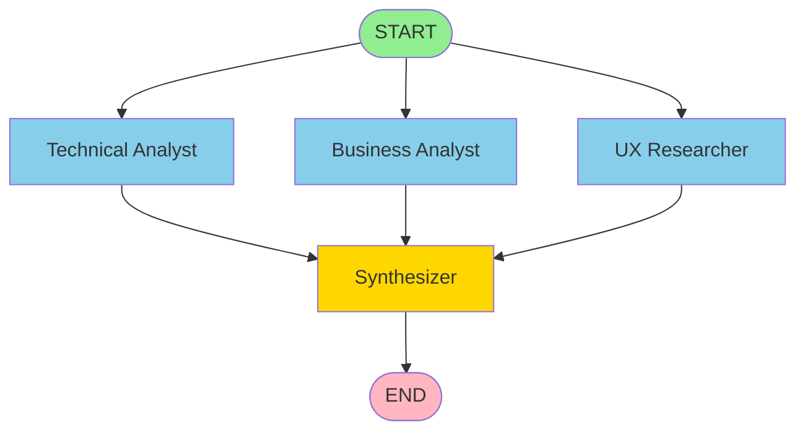
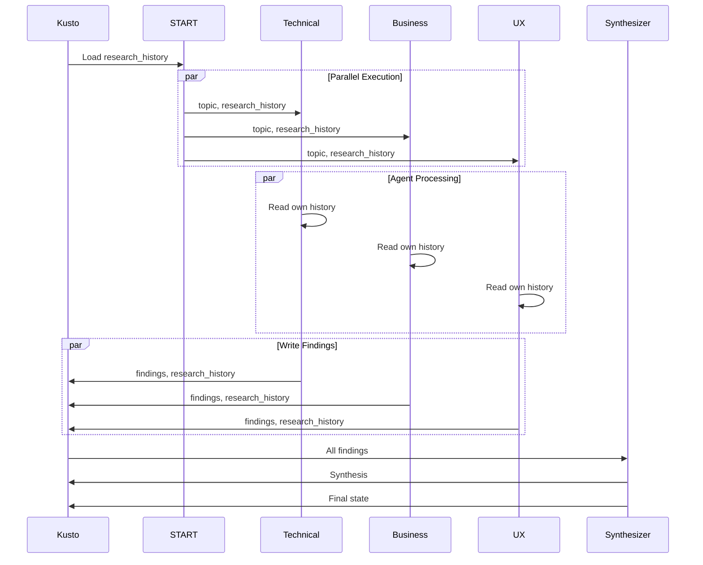

# Tutorial 05: Multi-Agent Collaboration

## Overview

This tutorial demonstrates how multiple AI agents can work together in parallel on a complex problem, sharing their findings and building on each other's work through Kusto checkpoints.

## Scenario: Research Team

Imagine a research team where each member has a different area of expertise:

- **Technical Analyst**: Evaluates technical architecture and implementation
- **Business Analyst**: Assesses business value and market fit
- **UX Researcher**: Analyzes user experience and adoption

All three agents:
1. Work **in parallel** on the same research topic
2. **Share findings** through a common state stored in Kusto
3. **Build on each other's work** in subsequent research phases
4. Converge to a **Synthesizer** that integrates all perspectives

## Key Concepts

### 1. Parallel Agent Execution

```python
# All agents work simultaneously
workflow.add_edge(START, "technical_analyst")
workflow.add_edge(START, "business_analyst")
workflow.add_edge(START, "ux_researcher")
```

### 2. Shared State with Reducers

```python
class ResearchState(TypedDict):
    """Shared across all agents."""
    messages: Annotated[list, add_messages]
    topic: str
    research_phase: str
    findings: Annotated[dict[str, str], merge_findings]  # Parallel updates
    research_history: Annotated[dict[str, list[str]], merge_research_history]  # Persistent
```

**Reducer functions** handle concurrent updates when agents run in parallel:
- `merge_findings`: Merges current session findings from parallel agents
- `merge_research_history`: Accumulates findings across sessions in Kusto

### 3. Persistent Context Across Sessions

Each agent loads previous research from Kusto and builds upon it:

```python
# Load from Kusto on startup
checkpoint = await checkpointer.aget_tuple(config)
previous_history = checkpoint.checkpoint.get("channel_values", {}).get("research_history", {})

# Agent sees own previous work
agent_history = research_history.get(agent_name, [])
# "In our previous research, I found: [last 3 findings]..."

# Agent appends new findings
updated_history[name] = updated_history[name] + [new_finding]
return {"research_history": updated_history}  # Persists to Kusto
```

This creates **cumulative intelligence** where knowledge compounds across sessions.

### 4. Multi-Phase Research

- **Phase 1: Initial Investigation** - Each agent explores independently
- **Phase 2: Deep Dive** - Agents build on Phase 1 findings
- **Phase 3: Synthesis** - Coordinator integrates all perspectives

## Architecture

### Execution Flow



### Data Flow with Kusto



All state persisted in Kusto at each step via checkpoint mechanism.

## Running the Tutorial

### Prerequisites

1. **API Keys** (same as Tutorial 04):
   ```powershell
   # Azure OpenAI
   $env:AZURE_OPENAI_ENDPOINT = "https://your-resource.openai.azure.com/"
   $env:AZURE_OPENAI_API_KEY = "your-key"
   $env:AZURE_OPENAI_DEPLOYMENT = "gpt-4o-mini"
   
   # OR OpenAI
   $env:OPENAI_API_KEY = "sk-..."
   ```

2. **Kusto Configuration**:
   ```powershell
   $env:KUSTO_CLUSTER_URI = "https://your-cluster.kusto.windows.net"
   $env:KUSTO_DATABASE = "langgraph"
   ```

### Run the Demo

```bash
cd examples
python tutorial_05_multi_agent.py
```

## Expected Output

```
🤖 Multi-Agent Research Team Demo
======================================================================

🤖 Using Azure OpenAI
   Endpoint: https://your-resource.openai.azure.com/
   Deployment: gpt-4o-mini

🗄️  Connecting to Kusto...
   Cluster: https://your-cluster.kusto.windows.net
   Database: langgraph

✓ Connected to Kusto
✓ Multi-agent workflow compiled

📊 Previous Research History Loaded:
   - technical_analyst: 2 previous findings
   - business_analyst: 2 previous findings
   - ux_researcher: 2 previous findings

======================================================================
🎯 Research Topic: LangGraph Multi-Agent Systems
======================================================================

📋 PHASE 1: Initial Investigation
----------------------------------------------------------------------
Deploying 3 specialist agents in parallel...

📊 Initial Findings:
----------------------------------------------------------------------

🔍 Technical Analyst:
   Building on my previous analysis of the graph-based architecture...
   [New findings that reference historical context]

🔍 Business Analyst:
   Considering the technical capabilities I previously identified...
   [New findings building on past work]

🔍 Ux Researcher:
   Given both technical and business insights from prior research...
   [New findings leveraging accumulated knowledge]

======================================================================
📋 PHASE 2: Deep Dive (Building on Phase 1)
======================================================================

📊 Deep Dive Findings:
----------------------------------------------------------------------

🔍 Technical Analyst:
   Building on the initial analysis, the technical implementation...

🔍 Business Analyst:
   Given the technical capabilities identified, the ROI potential...

🔍 Ux Researcher:
   Considering both technical and business aspects, the user...

======================================================================
📋 FINAL SYNTHESIS
======================================================================

[Synthesizer] Integrating all perspectives, LangGraph for multi-agent
systems presents a compelling solution that balances technical
sophistication with practical business value...

======================================================================
📜 Complete Research History (from Kusto)
======================================================================

Accumulated Research in Kusto:
   - technical_analyst: 4 findings total (2 previous + 2 new)
   - business_analyst: 4 findings total (2 previous + 2 new)
   - ux_researcher: 4 findings total (2 previous + 2 new)

Total interactions: 32
Session ID: research-team-20251028-155354

   👤 1. [User] Starting initial investigation...
   🤖 2. [technical_analyst] Technical analysis...
   🤖 3. [business_analyst] Business analysis...
   🤖 4. [ux_researcher] UX analysis...
   🤖 5. [Synthesizer] Initial synthesis...
   👤 6. [User] Starting deep dive...
   🤖 7. [technical_analyst] Deep technical analysis...
   ...

✨ Multi-Agent Research Complete!

💡 Research saved in Kusto with session: research-team-20251028-155354
   
   🔄 To continue this research session, use the same thread_id:
      python tutorial_05_multi_agent.py
   
   Agents will load all 4 previous findings per agent and build upon them!
```
```

## Key Features Demonstrated

### 1. Parallel Execution with Reducers
- All three specialist agents run simultaneously
- **Reducer functions** merge concurrent updates to `findings` and `research_history`
- No conflicts when multiple agents update state at the same time

### 2. Persistent Shared Memory via Kusto
- Each agent's findings stored in Kusto `research_history`
- Agents load previous findings on startup
- History accumulates across multiple executions
- True "team memory" that compounds over time

### 3. Collaborative Intelligence Across Sessions
- Agents see their own past work (last 3 findings shown in prompts)
- Agents aware of other agents' research counts
- Later phases build on earlier findings
- Each execution adds to cumulative knowledge
- Synthesizer integrates both current and historical perspectives

### 4. Session Continuity
- Reuse same `thread_id` to continue research
- Each run loads accumulated `research_history` from Kusto
- Knowledge compounds: Run 1 (2 findings) → Run 2 (4 findings) → Run N
- Full audit trail of all research sessions

## Customization

### Add More Agents

```python
security_agent = create_specialist_agent(
    "security_analyst",
    "security, compliance, and risk management",
    llm
)

workflow.add_node("security_analyst", security_agent)
workflow.add_edge(START, "security_analyst")
workflow.add_edge("security_analyst", "synthesizer")
```

### Change Research Topic

```python
initial_state = {
    "topic": "Your research topic here",
    "research_phase": "initial",
    "findings": {},
    "messages": []
}
```

### Add More Phases

```python
# Phase 3: Validation
validation_state = {
    "topic": "...",
    "research_phase": "validation",
    "findings": {},
    "messages": []
}

result = await app.ainvoke(validation_state, config=config)
```

## Querying Results in Kusto

### View All Research Sessions

```kql
Checkpoints
| where thread_id startswith "research-team-"
| project thread_id, created_at, checkpoint_id
| order by created_at desc
```

### View Research History for a Session

```kql
Checkpoints
| where thread_id == "research-team-20251028-155354"
| project channel_values
| extend research_history = channel_values.research_history
| mv-expand agent = bag_keys(research_history)
| extend findings_count = array_length(research_history[tostring(agent)])
| project agent, findings_count
```

### View Agent Execution Graph

```kql
// NODES: Agent execution nodes
let thread = "research-team-20251028-155354";
CheckpointWrites
| where thread_id == thread
| extend node_name = extract(@"~__pregel_pull, (.+)$", 1, task_path)
| where isnotempty(node_name)
| summarize 
    execution_count = dcount(task_id),
    first_execution = min(created_at),
    last_execution = max(created_at)
    by node_name
| project node_name, execution_count, first_execution, last_execution
| order by first_execution asc
```

### View Message Timeline

```kql
CheckpointWrites
| where thread_id == "research-team-20251028-155354"
| where channel == "messages"
| project created_at, task_path, value_json
| order by created_at asc
```

## Benefits

✅ **Parallel Processing** - Multiple agents work simultaneously  
✅ **Concurrent State Updates** - Reducer functions handle parallel writes safely  
✅ **Persistent Memory** - Kusto stores complete history across sessions  
✅ **Cumulative Intelligence** - Knowledge compounds with each execution  
✅ **Cross-Session Learning** - Agents build on previous research  
✅ **Scalable** - Add more agents easily  
✅ **Full Audit Trail** - Complete execution history in Kusto  
✅ **Reproducible** - Query any past research session

## Next Steps

- **Tutorial 06**: Implement human-in-the-loop approval workflows
- **Tutorial 07**: Create hierarchical agent teams (managers + workers)
- **Tutorial 08**: Build competitive agents that debate solutions

## Troubleshooting

### Parallel Update Errors

If you see `InvalidUpdateError: Can receive only one value per step`:

```python
# ❌ Wrong: Plain dict
research_history: dict[str, list[str]]

# ✅ Correct: Annotated with reducer
research_history: Annotated[dict[str, list[str]], merge_research_history]
```

### Agents Not Loading History

Check that checkpoint loading is working:

```python
checkpoint = await checkpointer.aget_tuple(config)
previous_history = checkpoint.checkpoint.get("channel_values", {}).get("research_history", {})
print(f"Loaded history: {previous_history}")
```

### Synthesizer Returns Coroutine

Ensure async wrapper is used:

```python
# ❌ Wrong: Lambda doesn't await
workflow.add_node("synthesizer", lambda state: synthesizer_agent(state, llm))

# ✅ Correct: Async wrapper
async def synthesizer_wrapper(state: ResearchState) -> ResearchState:
    return await synthesizer_agent(state, llm)
workflow.add_node("synthesizer", synthesizer_wrapper)
```

### Kusto Data Not Persisting

Wait for streaming ingestion to complete:

```python
await checkpointer.flush()
await asyncio.sleep(0.5)  # Allow Kusto ingestion
```

## Learn More

- [LangGraph Multi-Agent Docs](https://langchain-ai.github.io/langgraph/concepts/multi_agent/)
- [StateGraph API](https://langchain-ai.github.io/langgraph/reference/graphs/)
- [Checkpointer Concepts](https://langchain-ai.github.io/langgraph/concepts/persistence/)
