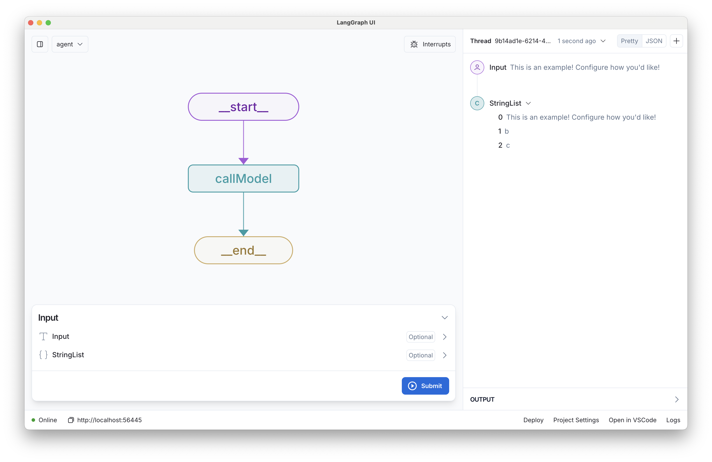

# New LangGraph.js Project

[](https://github.com/langchain-ai/new-langgraphjs-project/actions/workflows/unit-tests.yml)
[](https://github.com/langchain-ai/new-langgraphjs-project/actions/workflows/integration-tests.yml)
[![Open in - LangGraph Studio](https://img.shields.io/badge/Open_in-LangGraph_Studio-00324d.svg?logo=data:image/svg%2bxml;base64,PHN2ZyB4bWxucz0iaHR0cDovL3d3dy53My5vcmcvMjAwMC9zdmciIHdpZHRoPSI4NS4zMzMiIGhlaWdodD0iODUuMzMzIiB2ZXJzaW9uPSIxLjAiIHZpZXdCb3g9IjAgMCA2NCA2NCI+PHBhdGggZD0iTTEzIDcuOGMtNi4zIDMuMS03LjEgNi4zLTYuOCAyNS43LjQgMjQuNi4zIDI0LjUgMjUuOSAyNC41QzU3LjUgNTggNTggNTcuNSA1OCAzMi4zIDU4IDcuMyA1Ni43IDYgMzIgNmMtMTIuOCAwLTE2LjEuMy0xOSAxLjhtMzcuNiAxNi42YzIuOCAyLjggMy40IDQuMiAzLjQgNy42cy0uNiA0LjgtMy40IDcuNkw0Ny4yIDQzSDE2LjhsLTMuNC0zLjRjLTQuOC00LjgtNC44LTEwLjQgMC0xNS4ybDMuNC0zLjRoMzAuNHoiLz48cGF0aCBkPSJNMTguOSAyNS42Yy0xLjEgMS4zLTEgMS43LjQgMi41LjkuNiAxLjcgMS44IDEuNyAyLjcgMCAxIC43IDIuOCAxLjYgNC4xIDEuNCAxLjkgMS40IDIuNS4zIDMuMi0xIC42LS42LjkgMS40LjkgMS41IDAgMi43LS41IDIuNy0xIDAtLjYgMS4xLS44IDIuNi0uNGwyLjYuNy0xLjgtMi45Yy01LjktOS4zLTkuNC0xMi4zLTExLjUtOS44TTM5IDI2YzAgMS4xLS45IDIuNS0yIDMuMi0yLjQgMS41LTIuNiAzLjQtLjUgNC4yLjguMyAyIDEuNyAyLjUgMy4xLjYgMS41IDEuNCAyLjMgMiAyIDEuNS0uOSAxLjItMy41LS40LTMuNS0yLjEgMC0yLjgtMi44LS44LTMuMyAxLjYtLjQgMS42LS41IDAtLjYtMS4xLS4xLTEuNS0uNi0xLjItMS42LjctMS43IDMuMy0yLjEgMy41LS41LjEuNS4yIDEuNi4zIDIuMiAwIC43LjkgMS40IDEuOSAxLjYgMi4xLjQgMi4zLTIuMy4yLTMuMi0uOC0uMy0yLTEuNy0yLjUtMy4xLTEuMS0zLTMtMy4zLTMtLjUiLz48L3N2Zz4=)](https://langgraph-studio.vercel.app/templates/open?githubUrl=https://github.com/langchain-ai/new-langgraphjs-project)

This template demonstrates a simple chatbot implemented using [LangGraph.js](https://github.com/langchain-ai/langgraphjs), designed for [LangGraph Studio](https://github.com/langchain-ai/langgraph-studio). The chatbot maintains persistent chat memory, allowing for coherent conversations across multiple interactions.



The core logic, defined in `src/agent/graph.ts`, showcases a straightforward chatbot that responds to user queries while maintaining context from previous messages.

## What it does

The simple chatbot:

1. Takes a user **message** as input
2. Maintains a history of the conversation
3. Returns a placeholder response, updating the conversation history

This template provides a foundation that can be easily customized and extended to create more complex conversational agents.

## Getting Started

Assuming you have already [installed LangGraph Studio](https://github.com/langchain-ai/langgraph-studio?tab=readme-ov-file#download), to set up:

1. Create a `.env` file. This template does not require any environment variables by default, but you will likely want to add some when customizing.

```bash
cp .env.example .env
```

<!--
Setup instruction auto-generated by `langgraph template lock`. DO NOT EDIT MANUALLY.
-->

<!--
End setup instructions
-->

2. Open the folder in LangGraph Studio!
3. Customize the code as needed.

## How to customize

1. **Add an LLM call**: You can select and install a chat model wrapper from [the LangChain.js ecosystem](https://js.langchain.com/docs/integrations/chat/), or use LangGraph.js without LangChain.js.
2. **Extend the graph**: The core logic of the chatbot is defined in [graph.ts](./src/agent/graph.ts). You can modify this file to add new nodes, edges, or change the flow of the conversation.

You can also extend this template by:

- Adding [custom tools or functions](https://js.langchain.com/docs/how_to/tool_calling) to enhance the chatbot's capabilities.
- Implementing additional logic for handling specific types of user queries or tasks.
- Add retrieval-augmented generation (RAG) capabilities by integrating [external APIs or databases](https://langchain-ai.github.io/langgraphjs/tutorials/rag/langgraph_agentic_rag/) to provide more customized responses.

## Development

While iterating on your graph, you can edit past state and rerun your app from previous states to debug specific nodes. Local changes will be automatically applied via hot reload. Try experimenting with:

- Modifying the system prompt to give your chatbot a unique personality.
- Adding new nodes to the graph for more complex conversation flows.
- Implementing conditional logic to handle different types of user inputs.

Follow-up requests will be appended to the same thread. You can create an entirely new thread, clearing previous history, using the `+` button in the top right.

For more advanced features and examples, refer to the [LangGraph.js documentation](https://github.com/langchain-ai/langgraphjs). These resources can help you adapt this template for your specific use case and build more sophisticated conversational agents.

LangGraph Studio also integrates with [LangSmith](https://smith.langchain.com/) for more in-depth tracing and collaboration with teammates, allowing you to analyze and optimize your chatbot's performance.

<!--
Configuration auto-generated by `langgraph template lock`. DO NOT EDIT MANUALLY.
{
  "config_schemas": {
    "agent": {
      "type": "object",
      "properties": {}
    }
  }
}
-->
